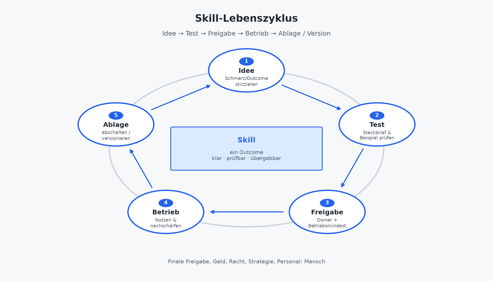

# Skill-Denken: Bausteine statt Prompt-Chaos

Teil I hat Orientierung geliefert: warum Skills Geld verdienen, welche Begriffe halten, wann Agent, Skill oder manuell die richtige Intervention sind. Teil II beginnt hier mit dem Fundament, das Chat-Alltag von Betrieb trennt: **Skill-Denken**. Der Untertitel des Buches ist der Kompass: *Welche Workflows ein Skill verdienen. Bauen, testen, im Mandat einsetzen.* Dieses Kapitel macht daraus Handwerk: vom einmaligen Prompt zur wiederverwendbaren Fähigkeit, mit Grenzen, Pflege und einem Lebenszyklus, den Geschäftsführung, IT und Solo gemeinsam tragen können.

Prompt-Chaos entsteht selten aus böser Absicht. Es entsteht, weil gestern etwas funktioniert hat und niemand die Fähigkeit festgehalten hat. Montags sitzt jemand im Chat und tippt „mach daraus ein Angebot“. Donnerstags sitzt jemand anderes oder dasselbe Ich unter Zeitdruck und tippt etwas Ähnliches, nur anders. Die Qualität driftet, die Annahmen verschwinden, und niemand kann sagen, welche Variante gerade gilt. Skill-Denken ist die Gegenbewegung: Bausteine statt Threads, Steckbriefe statt Geheimwissen, Versionen statt „der gute Prompt von Dienstag“.

## Vom einmaligen Prompt zur wiederverwendbaren Fähigkeit

Ein Prompt ist ein Werkbank-Moment. Er hilft, einen Entwurf anzustoßen, eine Struktur zu finden, eine Formulierung zu prüfen. Sobald derselbe Moment nächste Woche wiederkommt und jemand anderes (oder Ihr zukünftiges Ich) dieselbe Qualität braucht, reicht der Prompt nicht mehr. Dann brauchen Sie eine **Fähigkeit**: benannt, begrenzt, prüfbar, übergebbar.

Der Übergang lässt sich ohne Techniktheater in vier Schritten denken. Zuerst beobachten: Welcher Schritt wiederholt sich? Wo entstehen Uneinheitlichkeit, Nachfragen, Übergabeverlust? Dann benennen: Outcome in einem Satz. Wenn „irgendwie“ und „je nachdem“ nötig sind, ist der Schritt noch nicht skill-reif. Kapitel 3 hat das bereits gezeigt. Als Nächstes festziehen: Inputs, Outputs, Qualitätscheck, was bewusst *nicht* erlaubt ist. Das wird der Steckbrief, inhaltlich, nicht als Rohdatei in diesem Buch. Und schließlich bewähren: manuell oder halbautomatisch mit dem Steckbrief arbeiten, dann erst härten, versionieren, optional orchestrieren.

Der Cover-Gedanke „Angebot aus Kickoff“ ist genau dieser Übergang in einem Bild. Aus Notizen und Stichworten entsteht kein Zauberdokument, sondern ein **wiederholbarer Rohbau**. Leistungen, Annahmen, offene Punkte, nächste Schritte mit menschlicher Freigabe für Preis, Scope und Risiko. Der Prompt von gestern wird zur Fähigkeit von morgen, weil Struktur und Pflichtfelder festliegen.

Was dabei Geld verdient, ist nicht die Eleganz des Prompts. Es ist die **Anhaftung**: dieselbe Qualität über Mandate hinweg, weniger Neuaufsetzen, Übergabe an Vertretung oder IT-Betrieb möglich. Was nicht anhaftet, privater Chat-Verlauf, undokumentierte Varianten, „mach es wie letztes Mal“, bleibt Werkbank. Und Werkbank ist erlaubt; sie ist nur kein Betriebskapital.

### Beispielmuster: Angebot aus Kickoff-Notizen (ohne Code)

*(Muster, keine Fallstudie mit erfundenen Ergebnissen.)*

**Vorher (Prompt-Chaos):** Jemand kopiert Notizen in einen Chat, bittet um „ein Angebot“, bekommt Fließtext, streicht, ergänzt Preis aus dem Kopf, vergisst eine Annahme. Nächstes Mandat: anderer Prompt, andere Struktur, andere Lücken. Der Kunde merkt es nicht sofort, aber die Vertretung merkt es, wenn sie den Faden aufnehmen soll.

**Nachher (Skill-Denken):** Der Skill „Angebot aus Kickoff-Notizen“ erwartet benannte Inputs (Notizen oder Transkript-Auszug, ggf. Rahmenbedingungen) und liefert einen benannten Output: Entwurfsstruktur mit Pflichtfeldern. Qualitätscheck: Annahmen sichtbar, offene Punkte markiert, keine Preiszusage durch die KI. Owner gibt kundenreif frei. Derselbe Baustein dient Assistent, Agent oder manuellem Start, die Fähigkeit bleibt dieselbe.

Das Muster wiederholt die Logik aus Kapitel 1 und 3: Ein Workflow verdient einen Skill, wenn Wiederholung und Prüfbarkeit das Problem sind, nicht, wenn jede Instanz politische Einzelfallkunst ist.

### Was sich im Kopf ändert

Prompt-Denken fragt: „Wie formuliere ich die Anweisung heute?“ Skill-Denken fragt: „Welche Fähigkeit soll über Wochen und Personen hinweg dieselbe Struktur liefern?“ Die erste Frage optimiert den Moment. Die zweite baut Betriebskapital. Deshalb wirkt Skill-Denken anfangs langsamer: Steckbrief, Test, Freigabe. Danach wird es schneller weil niemand denselben Rohbau neu erfindet.

Für Teams heißt das auch: Der „gute Prompt“ darf nicht mehr als Privatbesitz gelten. Wer ihn allein im Verlauf hortet, erzeugt denselben Übergabeverlust, den Kapitel 1 beschrieben hat. Die Bibliothek ist der Ort, an dem Fähigkeiten öffentlich *im Betriebssinn* werden nicht öffentlich im Internet, sondern auffindbar für die, die sie brauchen und freigeben dürfen.

## Gute Skill-Grenzen: ein Outcome, klare Inputs und Outputs

Die häufigste Bau-Sünde ist der Alleskönner-Baustein: recherchieren, schreiben, layouten, versenden, „und gleich dem Kunden schicken“. So ein Gebilde ist weder prüfbar noch freigabefähig. Gute Skills folgen einer harten Regel:

> **Ein Skill = ein Outcome.**

Ein Outcome ist ein Ergebnis, das Sie in einem Satz abnehmen können: „Protokollstruktur mit offenen Fragen und Aktionsliste“, nicht „Kickoff irgendwie erledigt“. Grenzen schützen Qualität und Haftung und sie machen Freigabe erst möglich, weil klar ist, *was* freigegeben wird.

Zur Grenze gehören Outcome, Inputs, Outputs, Qualitätskriterien, Verbote sowie Owner und Freigabe. Der Outcome in einem Satz: Was ist fertig, wenn der Skill gelaufen ist? Die Inputs: Was muss vorliegen, in welcher Form und was passiert, wenn etwas fehlt (Stopp, Nachfrage, Platzhalter)? Die Outputs: Was entsteht wo. Entwurf, Liste, strukturierte Felder und was entsteht bewusst *nicht* (keine Unterschrift, kein Versand, keine Buchung)? Die Qualitätskriterien sind die Checkliste oder Pflichtfelder, an denen ein Mensch abnimmt. Die Verbote nennen Daten, die der Skill nicht lesen darf, Aktionen, die er nicht auslösen darf, Zusagen, die er nicht formulieren darf. Und Owner plus Freigabe klären, wer abnimmt und ab welcher Stufe etwas nach außen oder in kritische Systeme darf.

Steckbrief-Denke reicht auf der Fachseite für den Start. Die technischen Dateien liegen im Buch-Repo (https://github.com/rmdroid/cursor/tree/main/buch/skills-die-geld-verdienen/skills), nicht als SKILL.md-Dump in diesem Kapitel und nicht in privaten Autor-Repos. So bleibt das Kapitel für GF lesbar und für IT anschlussfähig.

### Schlechte vs. gute Schnitte (Muster)

| Zu breit (Anti-Pattern) | Besserer Schnitt |
|-------------------------|------------------|
| „Kundenkommunikation“ | Skill „Status strukturieren“ + Skill „kundenreife Mail formulieren“ (Freigabe getrennt) |
| „Angebot Ende-zu-Ende inkl. Versand“ | Skill „Angebotsentwurf aus Notizen“; Versand und Preis bleiben Mensch |
| „Recherche und Entscheidung“ | Skill „Quellen/Lücken sammeln“; Entscheidung bleibt Owner |
| „Alles für Marketing“ | Einzelne Outcomes am Wertstrom, gemeinsame Bibliothek |

Je schärfer der Schnitt, desto leichter Test, Freigabe und Wiederverwendung. Orchestrierung wenn nötig, übernimmt ein schmaler Agent oder ein Mensch, nicht ein monströser Skill.

### Inputs und Outputs benennen lernen

Schreiben Sie für den Kandidaten-Skill zwei Listen. Bei den Inputs zum Beispiel: Kickoff-Notizen, Angebotsvorlage oder Rahmen, bekannte Annahmen und explizit *nicht* enthaltene Geheimnisse. Bei den Outputs: strukturierter Entwurf mit Abschnitten A–D, Liste offener Fragen, Markierung „Preis/Scope: menschliche Entscheidung“.

Wenn Sie Inputs nicht listen können, fehlen Ablage oder Prozessklarheit, zurück zu Vereinfachen (Kapitel 3). Wenn Outputs nicht listen können, ist der Outcome noch eine Stimmung, keine Fähigkeit. Diese beiden Listen sind oft der Moment, an dem aus „wir könnten das automatisieren“ ein echter Steckbrief wird oder eben nicht, und das ist auch eine Entscheidung.

### Grenze und Mandat

Im Mandat sieht der Kunde das Ergebnis, nicht Ihren Skill-Namen. Trotzdem wirken Grenzen nach außen: Einheitliche Struktur, sichtbare Annahmen, keine stillen KI-Zusagen. Intern halten Grenzen Review und Haftung auseinander. Ein Skill, der „fast kundenreif“ liefert und nebenbei Preise andeutet, zwingt den Owner zu Detektivarbeit. Ein Skill, der Preise und Scope bewusst leer oder markiert lässt, macht Freigabe schnell.

Dieselbe Logik gilt für Kickoff-Nacharbeit und Statusberichte: Der Baustein strukturiert; der Mensch entscheidet, was verbindlich wird. Kapitel 2 hat die Verantwortungsgrenze gesetzt. Skill-Grenzen sind deren operative Form.

## Wann Skill statt neuer Agent

Kapitel 3 hat den Entscheidungsbaum geliefert: manuell lassen → vereinfachen → skillen → schmalen Agenten bauen. Hier die Betriebsfrage für Teil II: **Wann reicht der Baustein und wann erzeugen Sie unnötig bewegliche Teile?**

Skill zuerst, wenn ein **einzelner Outcome** das Problem löst, der Start weiterhin von einem Menschen oder Assistenten ausgelöst werden kann und Orchestrierung über mehrere Systeme noch nicht nötig ist. Skill zuerst auch, wenn Sie Prüfbarkeit und Übergabe brauchen nicht Automatik um der Automatik willen und wenn Pflegekapazität knapp ist. Besonders Solo: Ein harter Skill schlägt einen weichen Agenten.

Ein Agent kommt zusätzlich infrage, wenn mehrere Skills oder Werkzeuge **sinnvoll nacheinander** laufen müssen, ein klarer Trigger und ein klares Ziel existieren, Zugänge, Logs und Freigabegrenzen geklärt sind und ein Pilot mit Stop-Kriterium vereinbart ist. Fehlt eines davon, ist der Agent oft die teurere Antwort auf ein Skill-Problem.

### Die teure Fehlentscheidung

„Wir brauchen einen neuen Agenten“ ist oft die Antwort auf uneinheitliche Entwürfe, fehlende Vorlage oder Prompt-Wildwuchs. Ein neuer Agent ohne Bausteine verdoppelt Chaos, mehr Oberfläche, dieselbe Unklarheit. Die Reihenfolge im Buch bleibt: **Skill-Bibliothek vor Agenten-Zoo**. Wenige Outcomes, klare Bausteine, Orchester nur wenn nötig.

Für die Geschäftsführung heißt das: Portfolio auf Skills und Outcomes führen, nicht auf Bot-Namen. Für IT: Bibliothek und Identitäten zuerst. Für Solo: Agent nur als dünne Orchestrierung über bereits bewährten Skills oder gar nicht.

Ein zweites Warnsignal: „Wir bauen den Agenten, die Skills kommen später.“ Später kommt in der Praxis oft nicht oder als Prompt-Wildwuchs unter neuer Oberfläche. Wer orchestrieren will, braucht Instrumente. Skills sind die Instrumente. Ohne sie dirigiert der Agent Hoffnung.

### Mini-Entscheidung am Schreibtisch

Am Schreibtisch reicht oft eine kurze Kette. Kann ein Mensch mit Vorlage und Checkliste denselben Outcome liefern? Dann zuerst so dokumentieren. Wiederholt sich das mit vergleichbaren Inputs? Dann Skill. Müssen mehrere solcher Fähigkeiten ohne ständiges Handklicken verkettet werden? Dann schmalen Agenten prüfen. Droht ein weiterer Bot „für die Abteilung“? Stopp. Wertstrom und Bibliothek prüfen (Kapitel 3 und 5).

## Pflege, Versionierung, Ablage und der Verweis aufs Repo

Ein Skill ohne Pflege wird zum **Skill-Friedhof**: viele Namen, niemand weiß, welcher aktuell ist, Qualität driftet, Vertrauen sinkt. Pflege ist keine Nebensache. Sie ist Teil dessen, was Skills von Chat unterscheidet und der Ort, an dem der anfängliche Zeitverlust sich wieder auszahlt.

### Was „versionieren“ im Alltag heißt

Ohne Code im Buch, aber mit Betriebsregeln: Name und Zweck bleiben stabil; Verhalten ändert sich bewusst. Änderungen sind nachvollziehbar, was wurde geschärft, welche Inputs und Outputs, welche Verbote? Die aktuelle Version ist erkennbar, für Fachseite und IT gleichermaßen. Alte Varianten werden abgelegt oder markiert, nicht heimlich weiterverwendet. Und Abschaltung ist erlaubt und vorgesehen, wenn Qualität kippt oder der Workflow stirbt.

Dieses Buch spezifiziert **Beispiel-Skills** (Outcome, Inputs, Outputs, Checks, Verbote), für die Zielgruppen entwickelt, nicht aus privaten Skill-Repos. Die Dateien liegen unter https://github.com/rmdroid/cursor/tree/main/buch/skills-die-geld-verdienen/skills zum Download/Copy-Paste. Drei Muster decken den Mandatsalltag ab: **angebot-aus-kickoff** (https://github.com/rmdroid/cursor/tree/main/buch/skills-die-geld-verdienen/skills/angebot-aus-kickoff/SKILL.md) für den Angebotsrohbau; **protokoll-entscheidungen** (https://github.com/rmdroid/cursor/tree/main/buch/skills-die-geld-verdienen/skills/protokoll-entscheidungen/SKILL.md) für Meeting-Nacharbeit mit Owner; **status-mandat-kurz** (https://github.com/rmdroid/cursor/tree/main/buch/skills-die-geld-verdienen/skills/status-mandat-kurz/SKILL.md) für den kundenreifen Statusentwurf. Versand erst nach Freigabe. Im Buch stehen Wie/Warum/Wo; Rohdateien drucken wir nicht.

### Wer pflegt was

| Rolle | Pflegebeitrag |
|-------|----------------|
| Owner (Fach) | Outcome, Qualitätscheck, Freigabegrenzen, Abschaltentscheidung |
| IT / Betrieb | Zugänge, Logging, Bibliotheksort, technische Versionierung, Abschaltbarkeit |
| Solo (gebündelt) | Beides in einer Person, aber kalendarisch: Pflege-Slot, sonst Drift |

Ohne Owner kein zuverlässiger Skill. Ohne technischen Ort keine Übergabe. Ohne Abschaltbarkeit kein seriöser Betrieb. Die drei fehlen selten einzeln, sie fehlen oft zusammen, und dann hilft kein neuer Prompt.

Praktisch reicht oft ein schlanker Rhythmus: nach dem Pilot eine kurze Retrospektive (Was driftet? Was fehlt im Steckbrief?), danach ein fester Review-Takt, monatlich oder quartalsweise, je nach Nutzungshäufigkeit. Wer täglich denselben Skill fährt, merkt Drift früher; wer ihn selten nutzt, braucht bewusstes Nachsehen, sonst rostet er still.

### Ablage ist Führung, nicht Mülltonne

Ablage heißt: bewusst außer Betrieb nehmen, Wissen sichern, Verweise aktualisieren. Nicht: „liegt noch irgendwo, falls wir es brauchen“. Kapitel 9 vertieft Betrieb und Aufräumen; Kapitel 5 Ownership. Hier reicht die Regel: **Was niemand mehr testet, gehört nicht in die aktive Bibliothek.**

## Skill-Lebenszyklus: Idee → Test → Freigabe → Betrieb → Ablage

Skills sind keine einmalige Innovation. Sie durchlaufen einen Lebenszyklus. Wer Phasen überspringt, baut Ballast oder Risiko und merkt es oft erst, wenn Vertrauen schon weg ist.

Die **Idee** beginnt am Wertstrom: wiederkehrender Schritt, Übergabeverlust, Uneinheitlichkeit. Kurz skizzieren. Outcome, grobe Inputs und Outputs, warum *nicht* manuell oder nur Vorlage und den Realitätscheck aus Kapitel 3 anwenden.

Im **Test** wird der Steckbrief gefüllt und mit echten oder anonymisierten Beispiel-Inputs laufen gelassen. Checkliste anwenden. Review-Zeit ehrlich stoppen: Spart der Skill Tipparbeit und explodiert Review? Dann Inputs und Qualitätsschwellen schärfen oder den Use Case verwerfen. Kein Fantasie-ROI; Alltagskennzahlen folgen in Kapitel 10.

Zur **Freigabe** gibt der Owner den Skill für den vereinbarten Geltungsbereich frei: intern, mandatsbezogen, ggf. orchestrierbar. Freigabe umfasst Verbote und Datengrenzen. IT bestätigt Betriebsmindest. Zugänge, Logs, Abschaltbarkeit, soweit relevant. Ohne Freigabe kein „wir nutzen das jetzt alle“.

Im **Betrieb** folgt aktive Nutzung in Assistent, Agent oder manuellem Start. Beobachtung: Eskalationen, Fehlermodi (stale Daten, Doppelarbeit, fehlende Freigabe. Kapitel 9). Kleine Nachschärfungen versionieren. Routine erst nach Bewährung (Kapitel 2 und 9).

Zur **Ablage** kommt es, wenn der Workflow entfällt, Qualität dauerhaft unzureichend ist oder ein besserer Baustein den alten ersetzt: abschalten, markieren, aus der aktiven Bibliothek nehmen. Ablage ist Erfolgskontrolle, nicht Scheitern, sie verhindert den Friedhof.

Dieser Zyklus ist das Betriebsbild hinter dem Cover-Versprechen „bauen, testen, im Mandat einsetzen“: ohne Test keine Freigabe, ohne Freigabe kein Mandats-Einsatz, ohne Ablage kein nachhaltiges Portfolio.

Überspringen ist teuer in beide Richtungen. Idee direkt in „Betrieb“ ohne Test erzeugt Vertrauensverlust. Endloses Testen ohne Freigabe erzeugt Schatten-Nutzung. Ablage vergessen erzeugt den Friedhof, den Kapitel 15 als Fehler führt. Der Lebenszyklus ist deshalb kein Bürokratie-Extra, er ist die minimale Ordnung, die Bausteine von Chaos trennt.

## Anti-Patterns, die Skill-Denken zerstören

Die Fallen sind bekannt; die Gegenmittel passen in einen Atemzug. Prompt-Kopien statt Baustein heilen Sie mit einem Namen, einem Steckbrief, einer aktuellen Version. Den Skill-Friedhof mit Inventur, Owner und Ablage-Pflicht. Versteckte Rechte („darf mal eben alles lesen“) mit Verboten und Datenminimierung im Steckbrief plus IT-Freigabe. Den Alleskönner-Skill mit einem Outcome und Orchestrierung separat. Live ohne Freigabe mit der Stufe intern → kundenreif und Mensch für Geld, Recht, Außenwirkung. Und Code im Buch, Schatten-Kopien oder Privat-Repos mit https://github.com/rmdroid/cursor/tree/main/buch/skills-die-geld-verdienen/skills, keine Rohdatei-Pflege in Chat und Folien; keine privaten Autor-Repos verlinken.

Kapitel 8 vertieft Bau und Qualitätskriterien; Kapitel 15 sammelt Fehler und Gegenmittel buchweit.

## Anschluss an Orientierung und Ausblick

Kapitel 1 hat gezeigt, warum Anhaftung zählt und mit KfW Fokus 554 eingeordnet (vgl. Anhang C), dass KI im Mittelstand angekommen ist, oft noch als Einzelnutzung statt als prüfbare Skills. Dieses Kapitel liefert den Baustein-Weg dorthin: Grenzen, Lebenszyklus, Pflege. Keine neuen Prozentbehauptungen, kein ROI-Theater und keine zusätzlichen Zahlenclaims über die bereits geprüften Einordnungen hinaus.

Lesepfad light: GF liest Grenzen, Lebenszyklus-Freigabe und die Abschlussblöcke; IT liest Bibliothek, Versionierung und Anti-Patterns zu Rechten; Solo liest Angebot-aus-Kickoff-Muster, Mini-Entscheidung und den Pflege-Slot. Gemeinsam gilt: Bausteine schlagen Bots.

Als Nächstes in Teil II: **Organisation & Ownership** (Kapitel 5), wer Outcome und Abschaltung trägt und pragmatisch Recht/Risiko (Kapitel 6). Wer Skills baut, ohne Owner und Grenzen, hat Prompt-Chaos nur umbenannt.

## Abbildung

*Abbildung 4: Skill-Lebenszyklus: Idee → Test → Freigabe → Betrieb → Ablage.*

---

### Was die Geschäftsführung entscheidet

Welche Outcomes überhaupt einen Skill verdienen; dass Bausteine vor neuen Agenten kommen; wer Owner je Skill ist; dass Freigabe und Ablage Führungsthemen sind nicht „IT-Kram“; Pilot und Geltungsbereich vor Fläche.

### Was die IT-Leitung umsetzt

Skill-Bibliothek als Betriebsobjekt: Ort, Versionierung, Zugänge, Logs, Abschaltbarkeit; Steckbriefe an technische Umsetzung im https://github.com/rmdroid/cursor/tree/main/buch/skills-die-geld-verdienen/skills koppeln; Alleskönner- und Schatten-Skills inventarisieren; Fachbereichen beim Schnitt „ein Outcome“ helfen.

### Was Solo / Freiberufler morgen starten können

Wählen Sie **einen** der drei Muster-Skills und fahren Sie ihn eine Woche manuell mit Steckbrief:

- Angebot: https://github.com/rmdroid/cursor/tree/main/buch/skills-die-geld-verdienen/skills/angebot-aus-kickoff/SKILL.md
- Protokoll: https://github.com/rmdroid/cursor/tree/main/buch/skills-die-geld-verdienen/skills/protokoll-entscheidungen/SKILL.md
- Status: https://github.com/rmdroid/cursor/tree/main/buch/skills-die-geld-verdienen/skills/status-mandat-kurz/SKILL.md

Outcome, Inputs, Outputs, Checkliste, Verbote notieren; Review-Aufwand stoppen; noch keinen Agenten bauen. Pflege-Slot im Kalender.