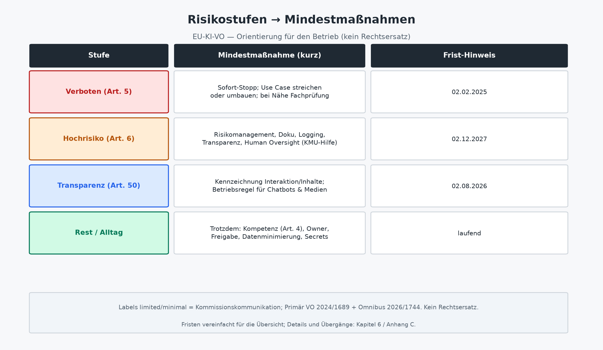

# Recht, Risiko, EU AI Act, pragmatisch

Dieses Kapitel gibt Orientierung für Geschäftsführung, IT und Freiberufler, **kein Rechtsersatz**. Es ersetzt keine anwaltliche Prüfung, keine Datenschutz-Folgenabschätzung und keine konformitätsrechtliche Beratung. Vor Druck und vor verbindlichen Freigaben im Betrieb: die **deutsche konsolidierte Fassung** der KI-Verordnung noch einmal gegenlesen und bei Zweifel Fachberatung einholen. Fristen und Artikelnummern hier: Stand Vera-Briefing / Spot-Check 7. September 2026; der reine 2024er Amtsblatttext ist für Hochrisiko-Termine nach dem Omnibus **veraltet**. URLs und Status: **Anhang C**.

Primäranker (Kurzbelege): `(VO (EU) 2024/1689; Omnibus 2026/1744)`, `(konsolidiert 27.07.2026)`. Für Fristen und Hochrisiko-Termine immer die konsolidierte Fassung bzw. die Omnibus-Änderung zitieren nicht nur den Originaltext von 2024.

## Warum Recht hier Betriebsentscheidung ist

Kapitel 2 hat Owner, Freigabe, Human-in-the-Loop und die Verantwortungsgrenze Mensch/KI gesetzt. Kapitel 5 hat daraus Organisationsform gemacht. Recht und Risiko machen daraus keine juristische Seminararbeit, sondern eine **Betriebsentscheidung**: Welche Skills und Agenten dürfen wir überhaupt betreiben? Was muss für Nutzer erkennbar sein? Was bleibt beim Menschen und was muss nachweisbar sein, wenn etwas schiefgeht?

Ohne diese Klärung entstehen drei teure Muster. Der **Panikstopp** blockiert sinnvolle Assistenz mit „KI ist verboten“, obwohl der Use Case im Alltagsbereich ohne spezielles Hochrisiko-Regime liegt. Der **Blindflug** lässt Chatbots und Agenten ohne Transparenz, ohne Owner, ohne Logging laufen, niemand kann erklären, wer freigegeben hat. Die **Papierlawine** produziert Konzerndokumentation für ein Tool, das Texte strukturiert oder Spam filtert, während Zugänge und Secrets weiter im Chat liegen.

Ziel hier: risikobasiert denken, die Fristen nach Omnibus kennen, und zuerst das absichern, was KMU und Solo realistisch schaffen bevor jemand „Compliance“ sagt und meint „hundertseitiges PDF“. Der Anschluss an Kapitel 2 bleibt eng: **menschliche Aufsicht** und **Transparenz** sind dort betriebliche Designentscheidungen. Hier bekommen sie den Primärrechtsanker (Art. 14, Art. 50, Art. 13) und den Zeitplan (Art. 113 nach Omnibus). Die Buchdefinition bleibt: KI schlägt vor; Mensch entscheidet bei Strategie, Geld, Recht, Personal und finaler Freigabe.

## Risikologik, was im Verordnungstext steht

Im Primärrecht sind die zentralen Blöcke klar benannt, das ist die Sprache, die in Freigaben und Steckbriefen halten sollte:

| Primärrechtliche Verankerung | Kurz |
|------------------------------|------|
| **Art. 5** | Verbotene Praktiken |
| **Art. 6** + Anhänge I/III | Hochrisiko-Einstufung |
| **Art. 50** | Transparenzpflichten (u. a. Interaktion mit KI, Kennzeichnung synthetischer Inhalte) |

Die Labels **„limited risk“** / **„minimal risk“** stammen vor allem aus **Kommissionskommunikation** (offizielle Policy-Darstellung der Risikostufen auf der AI-Act-Seite der Kommission). Sie sind hilfreich für die Erzählung und für Folien, aber **keine eigenen Kapitelüberschriften** der Verordnung. Im Buch deshalb: wenn „Transparenzrisiko“ oder „Alltagsanwendung ohne spezielles Regime“, immer an Art. 50 bzw. den Restbereich koppeln nicht so tun, als stünden „Limited“ und „Minimal“ als VO-Kapitel da.

Grobe Einordnung für den Alltag. Kommunikation plus Primärrecht: **Inakzeptabel / verboten (Art. 5)** umfasst bestimmte manipulative oder ausbeuterische Praktiken mit erheblichem Schaden, Social Scoring, bestimmtes Predictive Policing, ungezieltes Scraping für Gesichtserkennungs-Datenbanken, Emotionserkennung am Arbeitsplatz und in Bildung (mit Ausnahmen), bestimmte biometrische Kategorisierung sowie Echtzeit-Fernidentifikation in öffentlich zugänglichen Räumen (enge Ausnahmen). Der Omnibus ergänzt u. a. Verbote zu nicht-einvernehmlichen intimen bzw. CSAM-bezogenen Inhalten; neue Verbote dieser Art greifen laut Omnibus ab **02.12.2026**. Die Kommission hat dazu Leitlinien zu verbotenen Praktiken veröffentlicht `(EC Guidelines Art. 5)`. Auslegungshilfe, nicht Ersatz für den Verordnungstext.

**Hochrisiko (Art. 6)** meint Systeme nach **Anhang I** (Sicherheitsbauteile regulierter Produkte, Art. 6 Abs. 1) und Anwendungsfälle nach **Anhang III** (u. a. Biometrie, kritische Infrastruktur, Bildung, Beschäftigung/HR, essentielle Dienste, Strafverfolgung, Migration, Justiz. Art. 6 Abs. 2), mit Ausnahmen in Art. 6 Abs. 3–4. Wer eine Ausnahme nutzt, muss die Einstellungslogik dokumentieren können, „wir glauben nicht, dass es hochriskant ist“ reicht betrieblich nicht.

**Transparenz (Art. 50)** verlangt: Interaktion mit KI kenntlich machen; synthetische Inhalte maschinenlesbar kennzeichnen; Deepfakes und bestimmte Texte labeln. Kommissions-Leitlinien zu Art. 50: `(EC Guidelines Art. 50)`; Anwendung **ab 02.08.2026**.

Im **Restbereich** liegen viele Alltagsanwendungen ohne spezielles KI-VO-Regime, die Kommission nennt u. a. Spamfilter und KI in Spielen. Querschnittspflichten wie **Art. 4** (KI-Kompetenz) können trotzdem greifen.

Für die meisten Mittelstands-Skills. Protokollstruktur, Recherchehilfe, Entwurfsassistenz mit Freigabe, liegt der Praxisfokus oft bei Transparenz, Dokumentation light, Aufsicht und Datensicherheit, nicht automatisch bei voller Hochrisiko-Konformität nach Art. 9–14. Die Einstufung bleibt Einzelfall. Bei Anhang-III-Nähe (etwa HR-Vorauswahl, Zugang zu essentiellen Diensten, biometrische Systeme) früh Fachberatung und Zeitplan Richtung **02.12.2027**.

## Fristen nach Omnibus, die Termine, die im Betrieb zählen

Inkrafttreten der KI-VO: **01.08.2024** (Art. 113; 20. Tag nach Amtsblatt **12.07.2024**). Die Omnibus-VO **2026/1744** (Rechtsakt 08.07.2026, Amtsblatt **24.07.2026**) trat am **27.07.2026** in Kraft (dritter Tag nach Veröffentlichung).

Gestaffelte Anwendung nach Omnibus bzw. konsolidierter Logik:

| Datum | Was greift (vereinfacht) |
|-------|--------------------------|
| **02.02.2025** | Kapitel I und II (u. a. Art. 4 KI-Kompetenz, Art. 5 Verbote), mit Ausnahme neuer Art.-5-Tatbestände aus dem Omnibus |
| **02.08.2026** | Allgemeine Anwendung; **Transparenz Art. 50** (mit Übergangsregel für bestimmte generative Systeme, die vor diesem Datum in Verkehr gebracht wurden. Art. 50 Abs. 2 / Omnibus) |
| **02.12.2026** | Neue Verbote (Nudification/CSAM o. ä.); Übergangsfrist Art. 50 Abs. 2 für vor 02.08.2026 in Verkehr gebrachte generative Systeme |
| **02.12.2027** | Hochrisiko-Pflichten Kap. III Abschnitte 1–3 für Systeme nach **Art. 6 Abs. 2 / Anhang III** |
| **02.08.2028** | Hochrisiko-Pflichten Kap. III Abschnitte 1–3 für Systeme nach **Art. 6 Abs. 1 / Anhang I** |

Wichtig für Planung und für Gespräche mit der Geschäftsführung: Die Hochrisiko-Pflichten aus Kapitel III Abschnitte 1–3 gelten **nicht** mehr pauschal ab 02.08.2026. Anhang-III-Fälle: **02.12.2027**. Anhang-I-/Produktlinie: **02.08.2028**. Transparenz nach Art. 50 ist dagegen **ab 02.08.2026** relevant.

Wer noch mit der 2024er Lesart plant („alles Hochrisiko ab August 2026“), plant falsch. Wer Transparenz und Verbote auf „irgendwann 2027“ schiebt, plant ebenfalls falsch. Zwei Kalender, eine Betriebsregel: **jetzt** Transparenz und Stopp-Linien; **rechtzeitig vor 2027/2028** Hochrisiko-Vorbereitung, wenn der Use Case Anhang-Nähe hat.

## Kernartikel für Skills und Agenten

Kurz, betrieblich gelesen. Detailzitate immer gegen die konsolidierte DE-Fassung prüfen (Hinweis aus dem Vera-Dossier: Art.-4-Wortlaut kann durch Omnibus angepasst sein):

| Artikel | Betriebsrelevanz |
|---------|------------------|
| **Art. 4** | KI-Kompetenz (Omnibus-Fassung): Anbieter/Betreiber ergreifen Maßnahmen, die die **Entwicklung von KI-Kompetenz unterstützen und fördern**, ausdrücklich **ohne** Garantie eines bestimmten Niveaus bei Einzelpersonen. Schulung und Rollenverständnis gehören zum Betrieb, nicht nur zur Compliance-Folie. |
| **Art. 5** | Harte Stopp-Linie: verbotene Praktiken nicht „ausprobieren“ und nicht als Pilot tarnen. |
| **Art. 6** | Einstufung Hochrisiko über Anhänge I/III; Ausnahmen Art. 6 Abs. 3–4 nur mit nachvollziehbarer Begründung/Dokumentation. |
| **Art. 9** | Risikomanagementsystem für Hochrisiko, kontinuierlich, nicht einmalig beim Go-Live. |
| **Art. 11** | Technische Dokumentation vor Inverkehrbringen (+ Anhang IV); **KMU dürfen vereinfacht** liefern; Kommission soll vereinfachtes Formular erstellen (vor Druck prüfen, ob final verfügbar, im Briefing als offene Lücke markiert). |
| **Art. 12** | Automatische Ereignisprotokollierung (Logging). |
| **Art. 13** | Transparenz gegenüber Betreibern: Betriebsanleitungen, Fähigkeiten, Grenzen. |
| **Art. 14** | Wirksame **menschliche Aufsicht** über Hochrisiko-Systeme, direkter Anschluss an Human-in-the-Loop aus Kapitel 2. |
| **Art. 50** | Transparenz gegenüber Nutzern/Inhalten: Chatbots kennzeichnen, synthetische Medien und Deepfakes labeln. |
| **Art. 62** | KMU-Maßnahmen: u. a. Vorrang Reallabore, Schulung, Kanäle, Gebührenreduktion, Informationsplattform, Vorlagen. |
| **Art. 113** | Anwendungstermine, **nach Omnibus** lesen. |

Offizielle KMU-Anlaufstelle der EU: **AI Act Service Desk** `(AI Act Service Desk)` (Informationsplattform laut Art. 62 Abs. 3; URL in Anhang C). Ergänzend hilfreich, aber Sekundärquellen: `(Bitkom Umsetzungsleitfaden 2.0)`, `(Mittelstand-Digital KI-VO Handbuch)`, `(BNetzA Factsheet KMU)`, `(BSI QUAIDAL)` (Datenqualität, technisch, kein vollständiger Rechtsleitfaden).

## Dokumentation, Transparenz, Aufsicht im Alltag

Für Skills und Agenten übersetzt sich Recht in wenige Betriebsregeln, anschlussfähig an Kapitel 2 und Kapitel 5. Jeder produktive Skill oder Agent hat einen **Owner**: eine menschliche Person für Outcome, Qualität und Abschaltung. „Die IT“ oder „das Tool“ reicht nicht. **Freigabegrenzen** stehen schriftlich: Was darf der Agent allein? Was braucht Review? Was braucht GF-Freigabe? Geld, Recht, Personal, Strategie, finale Außenwirkung bleiben menschlich, die Verantwortungsgrenze aus Kapitel 2, jetzt mit regulatorischem Rückenwind, wo Art. 14 greift.

**Transparenz** gilt nach außen und innen. Wenn Nutzer mit einem KI-System interagieren, muss das nach Art. 50 erkennbar sein. Intern trägt der Steckbrief Fähigkeiten und Grenzen. Art.-13-Logik auch ohne Hochrisiko sinnvoll: Was kann der Skill? Was darf er nicht? Welche Daten braucht er? **Logging light** hält fest, wer wann welchen Entwurf erzeugt, welche Datenquellen genutzt und wer freigegeben hat. Art. 12 verlangt für Hochrisiko automatische Protokolle; für den Alltag reicht oft ein nachvollziehbarer Nachweis ohne Konzern-SIEM, aber ohne Nachweis gibt es im Streitfall nur Vermutungen.

**Human Oversight** ist Design, kein Nachsatz. Art. 14 verlangt wirksame Aufsicht bei Hochrisiko. Buchregel für alle kritischen Outcomes: Human-in-the-Loop mit Person und Zeitpunkt, vor Versand, vor Buchung, vor Kundenübergabe. Aufsicht ohne benannte Person ist Theater (Kapitel 2). **KI-Kompetenz (Art. 4)** meint Maßnahmen zur **Unterstützung und Förderung** der Kompetenzentwicklung (Omnibus): Wer freigibt, soll die Grenzen des Systems kennen. Halluzinationen, stale Daten, Scope-Creep. Eine kurze Betriebsanleitung und ein Freigabe-Check schlagen eine ungelesene Policy; ein bestimmtes Kompetenzniveau wird **nicht** garantiert.

Dokumentation muss **übergebbar** sein. Kapitel 2: Skill-Eigenschaft. Ein Chat-Verlauf ist keine Dokumentation. Ein Steckbrief mit Outcome, Inputs/Outputs, Risiken, Owner, Transparenzhinweis und Stopp-Kriterien schon. Für Hochrisiko kommt die technische Dokumentation nach Art. 11 hinzu. KMU mit Vereinfachung, nicht mit Ausrede „wir sind zu klein für Papier“.

Praktischer Wochenrhythmus für laufende Agenten: einmal kurz prüfen, ob Owner noch stimmt, ob Freigaben greifen, ob Kennzeichnung sichtbar ist, ob Secrets rotiert oder geleakt wurden. Das ist Betrieb (Kapitel 9), nicht Juristerei, aber es verhindert die typische Lücke zwischen „wir haben eine Policy“ und „niemand hält sie ein“.

## Datenminimierung, Zugänge, Secrets

Rechtliche Einstufung und Informationssicherheit greifen ineinander. Viele Schäden entstehen, bevor jemand Anhang III diskutiert: Kundendaten im falschen Chat, API-Keys im Skill-Text, Agenten mit Admin-Rechten „weil es einfacher war“.

Die pragmatische Mindestlinie beginnt bei **Datenminimierung**: Nur die Daten in den Kontext geben, die der Outcome braucht. Keine „volles CRM in den Prompt“-Kultur. Weniger Kontext ist oft weniger Risiko und bessere Prüfbarkeit. **Zugänge** bleiben getrennt: Agentenidentität ist nicht persönliche Admin-Rechte. Least Privilege. Schreibrechte in ERP/CRM nur mit Freigabe und Logging. Lesezugriff auf Personal- oder Mandatsakten nur, wenn der Use Case das zwingend braucht.

**Secrets** gehören nicht in Chats, nicht in Skill-Texte, nicht in „Vaults“, die eigentlich nur ein geteilter Ordner sind. API-Keys, Mandantengeheimnisse, Personaldaten und Vertragsentwürfe liegen in freigegebenen Speichern und echtem Secrets-Management nicht in Prompt-Historien, Tickets oder öffentlichen Repos. Die **Mandatsgrenze** gilt digital wie physisch: Kundendaten eines Mandats nicht in fremde Modelle oder Chats ohne klare vertragliche und technische Basis. Freiberufler: derselbe Standard wie bei einer physischen Akte, nur digital leichter zu verletzen. **Aufbewahrung und Löschung** gehören dazu: Entwürfe und Logs haben eine Lebensdauer; „ewig im Chat“ ist kein Archivkonzept und keine Nachweisstrategie.

Das ist keine vollständige DSGVO-Abhandlung und kein BSI-Handbuch. Es ist die Stelle, an der GF, IT und Solo denselben Satz unterschreiben können: **Was der Skill nicht braucht, bekommt er nicht.**

## Was KMU und Solo realistisch zuerst absichern

Reihenfolge statt Vollständigkeitsillusion, angelehnt an Art. 5, 50, 4, 62 und die Omnibus-Fristen. Zuerst ein **Inventar light**: Welche KI-Tools, Skills, Agenten laufen? Owner? Außenwirkung? Kundenkontakt? Dann der **Art.-5-Check**: Nichts betreiben, was in die Verbotsnähe rutscht. Manipulation, unzulässige Emotionserkennung am Arbeitsplatz, Social Scoring o. ä. Im Zweifel stoppen und prüfen; Pilot ist keine Ausnahme vom Verbot.

**Transparenz Art. 50** ab **02.08.2026**: Kennzeichnung dort, wo Nutzer mit KI interagieren oder synthetische Inhalte ausgespielt werden. Leitlinien der Kommission nutzen; eine interne Regel reicht oft für den Start. Chat-Hinweis, Label in der Medienpipeline. **Freigabe und Aufsicht** besonders bei Kundenkommunikation, HR-nahen Workflows, Finanz- und Rechtsentwürfen: Owner plus Zeitpunkt, nicht „irgendwer schaut mal“. **Zugänge und Secrets**: Keys rotieren, Chat-Leaks stoppen, Mandantentrennung, Least Privilege für Agenten.

**Kompetenz Art. 4**: kurze, fördernde Schulung für alle, die freigeben oder Agenten bedienen. Was darf das System? Was nicht? Wann eskalieren? Unterstützen und fördern, nicht zertifizieren oder garantieren. **Hochrisiko-Radar**: Liegt der Use Case nah an Anhang III (Beschäftigung, Bildung, essentielle Dienste, Biometrie …) oder Anhang I? Dann früh Einstufung und Zeitplan Richtung **02.12.2027** bzw. **02.08.2028** nicht erst kurz vorher. **KMU-Hilfen nutzen**: Art. 62, AI Act Service Desk, vereinfachte Dokumentation nach Art. 11, BNetzA-Factsheet, Mittelstand-Digital-Handreichungen bevor teure Schattenprozesse entstehen.

Solo-Freiberufler: dieselben Punkte auf einer Seite. Ein Agent mit Kundendaten ohne Freigabelogik und ohne Secret-Disziplin ist riskanter als zehn klar begrenzte Skills mit Owner „ich“ und manueller Freigabe. Skalierung kommt nach Bewährung (Kapitel 3 und 7). Compliance-Licht folgt derselben Logik: erst Grenzen, dann Tempo.

## Was dieses Kapitel bewusst nicht leistet

Keine abschließende Einstufung Ihres konkreten Systems. Kein nationales Durchführungsgesetz im Detail. Keine Bußgeld-Dramatisierung mit Fantasiezahlen. Keine Garantie, dass „minimal“ aus der Kommissionsgrafik Sie von allen Pflichten befreit. Querschnitt (Art. 4) und andere Rechtsgebiete bleiben. Und keinen Ersatz für die konsolidierte Fassung beim Druck: DE-Konsolidierung (CELEX 02024R1689-20260727) noch einmal lokal öffnen.

## Abbildung

*Abbildung 6: Risikostufen und Mindestmaßnahmen nach EU-KI-VO. Orientierung, kein Rechtsersatz.*

---

### Was die Geschäftsführung entscheidet

Dass KI-Vorhaben risikoklassifiziert und mit Owner versehen werden; dass verbotene Praktiken (Art. 5) absolute Stopp-Linie sind; welche Outcomes vor Hochrisiko-Fristen (**02.12.2027** / **02.08.2028**) bewusst nicht skaliert werden; Budget für Kompetenz (Art. 4) und ggf. Fachberatung; dass Transparenz ab **02.08.2026** nicht „IT-Thema allein“ ist.

### Was die IT-Leitung umsetzt

Inventar der Skills/Agenten; Zugangs- und Secret-Management; Logging und Abschaltbarkeit; Kennzeichnung nach Art. 50 in Frontends und Content-Pipelines; Steckbriefe mit Grenzen (Art.-13-Logik); bei Anhang-Nähe technische Dokumentation und Oversight-Hooks (Art. 9–14) vorbereiten; Service-Desk- und konsolidierte EUR-Lex-Verweise aus Anhang C im Betriebshandbuch light.

### Was Solo / Freiberufler morgen starten können

Eine Seite: Liste genutzter KI-Tools; Haken bei „kein Art.-5-Risiko“, „Kundendaten nicht in fremde Chats“, „Keys nicht im Prompt“, „Alles Kundenreife hat Freigabe“, „KI-Nutzung erkennbar wo nötig (Art. 50)“. Nächsten Skill nur mit einem Outcome und Owner „ich“. Bei HR-, Biometrie- oder essentiellen-Dienste-Nähe: stoppen und Einstufung klären nicht „später“.
