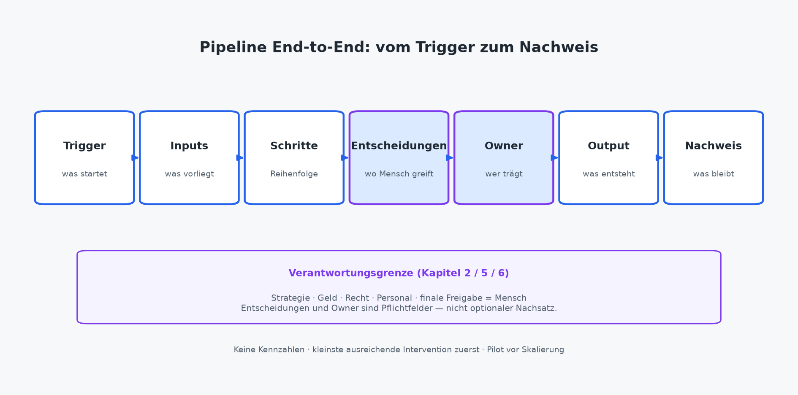

# Methode: Vom Prozess zum Agenten

Teil II hat das Fundament gelegt: Skills als wiederholbare Fähigkeiten, Ownership und Freigabe als Organisationsform, Recht und Risiko als Betriebsgrenzen. Teil III beginnt hier — mit der Frage, die Teams am häufigsten überspringen und später teuer nachholen: **Wie kommt man vom bestehenden Ablauf zu einem betreibbaren Agenten — ohne Murks zu automatisieren und ohne den Zoo zu eröffnen?**

Die Antwort ist keine Plattform-Roadmap. Es ist eine Methode: den Prozess sichtbar machen, die kleinste ausreichende Intervention wählen, einen Pilot mit Stop-Kriterium fahren, erst dann skalieren. Kapitel 3 hat den Entscheidungsbaum als Realitätsfilter geliefert. Dieses Kapitel macht daraus Handwerk — Schritt für Schritt, mit zwei Fallskizzen als **Muster** (Mittelstand und Freelancer), ohne erfundene ROI-Zahlen und ohne den Anspruch, dass jedes Vorhaben bei „Agent“ landen muss.

Wer hier ehrlich arbeitet, spart in Kapitel 8 und 9 Wochen. Spezifikation ohne Pipeline wird zu Wunschzetteln. Agenten ohne Pilot werden zu Demo-Schulden. Die Methode ist absichtlich schlicht — sie soll an einem Nachmittag auf eine Seite passen und trotzdem Freigabe und Alltag überstehen.

## Die Pipeline: vom Trigger zum Nachweis

Jeder Workflow, der einen Skill oder Agenten verdienen soll, lässt sich in derselben Kette beschreiben. Wer die Kette nicht füllen kann, baut Hoffnung — nicht Betrieb. Die sieben Felder sind kein Formularfetisch. Sie sind die gemeinsame Sprache für GF, Fachseite und IT: Was startet, was liegt vor, was läuft, wo wird entschieden, wer trägt, was entsteht, was bleibt nachvollziehbar.

**Trigger.** Was startet den Ablauf? Ein Terminende, eine Mail, ein Ticket, ein Kalender-Slot, ein manueller Knopf. Ohne benennbaren Trigger bleibt „irgendwann machen wir das mit KI“ — und irgendwann ist kein Betriebszustand. Ein guter Trigger ist beobachtbar und wiederholbar. „Wenn der Vertrieb Zeit hat“ ist kein Trigger; „wenn Kickoff-Termin auf erledigt steht“ schon.

**Inputs.** Was muss vorliegen, in welcher Form? Notizen, Vorlage, Ordnerpfad, Ticketfelder. Was fehlt bewusst — und was passiert dann: Stopp, Nachfrage, markierter Platzhalter? Wenn Inputs „im Kopf von …“ leben, ist der nächste Schritt Vereinfachen, nicht Orchestrieren. Datenminimierung aus Kapitel 6 gehört hier hinein: Was der Outcome nicht braucht, kommt nicht in den Kontext. „Volles CRM in den Prompt“ ist kein Input-Konzept — es ist ein Risiko mit Tempo-Vorwand.

**Schritte.** Welche Arbeitsschritte folgen sinnvoll nacheinander? Nicht die Wunschfantasie „alles auf einmal“, sondern die reale Reihenfolge: sammeln, strukturieren, prüfen, freigeben, ablegen. Jeder Schritt, der als Skill abgrenzbar ist, wird später ein Bibliothekseintrag. Jeder Schritt, der Urteilskraft braucht, bleibt Mensch — oder bekommt eine klare Entscheidungsstelle. Die Handoff-Logik aus Kapitel 5 (Artefakt, Status, nächste Rolle) steckt in genau diesen Schritten: Ohne benannte Übergabe orchestriert niemand, sondern klickt im Kreis.

**Entscheidungen.** Wo wird gewählt, gestoppt, eskaliert? Preis, Scope, Versand, Schreibrecht in kritische Systeme: das sind keine „Schritte“, sondern Entscheidungspunkte mit Owner. Wer Entscheidungen in den Prompt versteckt, bekommt Tempo ohne Steuerbarkeit. Markieren Sie Entscheidungen sichtbar im Output — „menschliche Entscheidung“ ist ein Pflichtfeld, keine Fußnote.

**Owner.** Wer trägt Outcome, Qualität und Abschaltung? Kapitel 5 hat das gesetzt; in der Pipeline wird der Name konkret. Ein Agent ohne Owner in dieser Zeile ist ein Experiment mit schöner Demo. Vertretung oder Pause notieren: Sonst entsteht heimliche Zweit-Ownership über Chat-Verläufe, sobald der erste Owner im Urlaub ist.

**Output.** Was entsteht wo — und was entsteht bewusst *nicht*? Strukturierter Entwurf, Aktionsliste, Statusfelder. Keine Unterschrift, kein Kundenversand, keine Buchung durch die KI, wenn die Freigabegrenze das verbietet. Der Output muss abnehmbar sein — in einem Satz, ohne „irgendwie“. Sonst ist der Outcome noch eine Stimmung.

**Nachweis.** Was bleibt nachvollziehbar: Version des Skills, wer freigegeben hat, welche Inputs genutzt wurden, wann pausiert wurde? Nachweis ist keine Konzernbürokratie. Es ist die Spur, die Vertretung, Audit und Lernen brauchen — und die Chat-Verläufe selten liefern. Light reicht: Ort, Version, Freigabezeitpunkt. Ohne Spur kein seriöser Pilot und kein Lernen für Kapitel 10.

Die Kette in einem Satz: **Trigger holt Inputs, Schritte erzeugen Output, Entscheidungen und Owner steuern, Nachweis hält den Betrieb.** Fehlt ein Glied, merken Sie es spätestens im Pilot — besser vorher auf dem Papier.

### Kurzschema (textlich)

```
Trigger → Inputs → Schritte → Entscheidungen → Owner → Output → Nachweis
     │         │         │            │           │        │         │
   Start    Stoff     Skills     Stopps/      Name    Ergebnis   Spur
                      /Skills     Freigaben
```

Das ist die End-to-End-Pipeline — siehe Abbildung am Kapitelende. Keine Kennzahlen darin — nur Reihenfolge und Verantwortungsgrenze. Wer die sieben Felder für einen Use Case ausfüllen kann, hat die Spezifikation für Kapitel 8 schon halb geschrieben. Wer sie nicht ausfüllen kann, hat noch keinen Use Case — sondern eine Idee auf der Suche nach einem Prozess.

## Kleinste ausreichende Intervention — vor dem ersten Agenten

Die Pipeline verführt dazu, gleich „Agent“ zu denken. Die Methode verlangt das Gegenteil: **so wenig bewegliche Teile wie nötig.** Kapitel 3 hat die Stufen genannt; hier sind sie die Pflichtreihenfolge vor jedem Bauentscheid. Die Pipeline füllen und die Stufe wählen gehören zusammen: Erst sehen, dann eingreifen.

**Nichts bauen.** Wenn der Ablauf selten ist, jede Instanz Einzelfallkunst braucht oder Freigabe und Haftung den Aufwand dominieren: manuell lassen. Die Pipeline hilft trotzdem — sie macht sichtbar, *warum* manuell die richtige Antwort ist, und verhindert, dass „wir müssten eigentlich …“ monatelang als Schattenprojekt lebt. Manuell ist keine Niederlage. Es ist oft die unternehmerisch klarere Antwort — besonders bei Strategie, Geld, Recht, Personal und finaler Außenfreigabe.

**Vereinfachen.** Vorlage festziehen, Pflichtfelder benennen, doppelte Ablagen zusammenführen, Owner und Abnahmezeitpunkt klären. Viele „Agenten-Ideen“ sterben friedlich an dieser Stelle — und das ist ein Erfolg. Wer den manuellen Ablauf mit Vorlage nicht hinbekommt, skillt Murks. Vereinfachen spart im Mittelstand oft mehr Nerven als der erste Agent, weil Übergaben und Nachfragen sinken, bevor überhaupt ein Modell läuft.

**Skillen.** Ein Outcome, klare Inputs und Outputs, Qualitätscheck, Verbote (Kapitel 4). Oft reicht der Skill am Arbeitsplatz oder im Assistenten. Drei Muster aus dem Buch-Repo decken den Mandatsalltag ab, ohne dass Sie neu erfinden müssen:

- **angebot-aus-kickoff** — Angebotsrohbau aus Notizen
- **protokoll-entscheidungen** — Meeting-Nacharbeit mit sichtbaren Entscheidungen und offenen Punkten
- **status-mandat-kurz** — strukturierter Statusentwurf; Versand erst nach Freigabe

Basis: https://github.com/rmdroid/cursor/tree/main/buch/skills-die-geld-verdienen/skills (Steckbriefe dort; im Buch bleiben Wie, Warum und Wo).

**Dann Agent.** Erst wenn mehrere Schritte oder Skills sinnvoll orchestriert werden müssen, Trigger und Ziel klar sind, Zugänge und Logs stehen und ein Pilot mit Stop-Kriterium vereinbart ist. Der Agent ist Orchester, nicht Ersatz für fehlende Instrumente. Skills zuerst — sonst dirigieren Sie Hoffnung. „Bauen“ heißt in diesem Buch: Betriebsmittel mit Grenzen, nicht Demo ohne Owner.

Die teure Abkürzung „wir bauen den Agenten, die Skills kommen später“ bleibt verboten. Später kommt in der Praxis oft nicht — oder als Prompt-Wildwuchs unter neuer Oberfläche. Dieselbe Logik gilt rückwärts: Wenn der Pilot zeigt, dass ein Skill allein trägt, brauchen Sie den Agenten nicht nachzurüsten, nur um die Roadmap zu erfüllen.

## Pilot vor Skalierung

Skalierung ohne Pilot ist der zweithäufigste Fehler nach „Murks automatisieren“. Der Pilot ist kein Mini-Go-Live für die ganze Firma. Er ist ein **begrenzter Bewährungsraum**: ein Auftragstyp oder eine Mandatsreihe, ein Owner, eine Skill-Version (oder ein schmaler Agent darüber), ein Zeitraum, ein Stop-Kriterium.

Was der Pilot klären soll — ohne Fantasie-ROI: Kommen die Inputs rechtzeitig und in brauchbarer Form? Trifft der Output die Pflichtfelder so oft, dass Review tragbar bleibt? Wo eskaliert es — und ist die Eskalation im Steckbrief vorgesehen? Hält die Freigabegrenze (intern → kundenreif), oder rutscht Rohbau still nach außen? Und: Würde der Owner denselben Ablauf nächste Woche wieder so starten?

Was der Pilot *nicht* klären muss: ob „die Organisation KI-ready ist“, ob alle Abteilungen denselben Bot brauchen, ob sich Investitionen in drei Jahren amortisieren. Messung ohne Behauptungs-ROI folgt in Kapitel 10 — Zeit, Fehlerquote, Durchlauf, Eskalationen, Review-Last. Hier reicht die Betriebsfrage: **Läuft der schmale Pfad stabil genug, um ihn bewusst auszuweiten — oder zu pausieren?**

Stop-Kriterien gehören vor dem Start auf eine Seite. Qualität kippt trotz Nachschärfung. Review dauert länger als der frühere manuelle Schritt, ohne dass Inputs besser werden. Daten- oder Freigabegrenze wird regelmäßig überschritten. Owner fehlt oder wechselt heimlich. Stopp ist Erfolgskontrolle, nicht Gesichtsverlust. Kapitel 9 vertieft Betrieb und Abschalten; Kapitel 14 baut den 90-Tage-Rahmen darum.

Praktisch reicht ein schlankes Pilot-Gate: Pipeline ausgefüllt, Intervention gewählt (oft Skill, selten sofort Agent), Owner und Freigabegrenze namentlich, Zugänge und Nachweis light mit IT geklärt, Stop-Kriterien unterschrieben — dann Start. Fehlt eines davon, ist der „Pilot“ eine Demo mit Publikum.

Skalierung heißt danach: Geltungsbereich erweitern (mehr Mandate desselben Typs, zweite Rolle mit demselben Skill), nicht „jede Abteilung bekommt eine Variante“. Wertstrom vor Organigramm — Kapitel 3 bleibt verbindlich. Wer skaliert, kopiert bewährte Skills und Grenzen, nicht hoffnungsvolle Abteilungsnamen.

## Fallskizze Mittelstand: Angebot bis Kickoff-Nacharbeit

*(Muster, keine Fallstudie. Keine erfundenen Stunden- oder Euro-Angaben. Geprüfte Quellen und Kennzahlen nur über Anhang C, sofern vorhanden — hier absichtlich keine Zahlenclaims.)*

Ein Betrieb mit Vertrieb und Projektstart merkt denselben Schmerz an der Nahtstelle: Angebote und Kickoff-Protokolle wirken uneinheitlich, Übergaben erzeugen Nachfragen, Vertretungen finden den Faden nicht. Kunden erleben den Bruch als „zwei Firmen in einer“. Intern entsteht Doppelarbeit: Status anders formuliert, Annahmen anders notiert, offene Punkte anders vergessen. Die Versuchung lautet „ein Bot für Vertrieb“ und „ein Bot für Projekte“. Die Methode sagt: Pipeline zuerst — Outcome am Wertstrom, nicht Bot am Organigramm.

**Trigger.** Angebot angefragt bzw. Kickoff terminiert/beendet.  
**Inputs.** Gesprächsnotizen oder Transkript-Auszug, Rahmenbedingungen, bestehende Vorlage — nicht das ganze CRM.  
**Schritte.** Stoff ordnen → Angebots- oder Protokollrohbau erzeugen → fachlich prüfen → freigeben → ablegen.  
**Entscheidungen.** Preis, Scope, verbindliche Zusagen, Kundenversand: Mensch.  
**Owner.** Eine Person für den Outcome „kundenreifer Einstieg“ — oder zwei Owner mit verbindlichem Übergabeformat zwischen Angebot und Kickoff.  
**Output.** Strukturierter Entwurf mit Annahmen und offenen Punkten; kein stiller Versand.  
**Nachweis.** Skill-Version, Freigabezeitpunkt, Ablageort.

Die kleinste ausreichende Intervention beginnt oft bei der Vorlage und den Pflichtfeldern — dieselbe Struktur für Angebot und Kickoff-Nacharbeit, soweit der Wertstrom das trägt. Danach skillen: **angebot-aus-kickoff** für den Rohbau, **protokoll-entscheidungen** für die Kickoff-Nacharbeit. Ein schmaler Agent kommt erst infrage, wenn Notizen holen, Skill ausführen und Ablage orchestriert werden sollen — mit Logs und Stopp vor Kundenversand. Zwei Skills, eine Kette, ein Owner-Modell schlagen zwei Abteilungsbots mit unterschiedlicher Sprache.

Der Pilot bleibt schmal: einen Auftragstyp oder eine Region, ein Owner, ein Zeitraum, Stop-Kriterium auf einer Seite. Erst wenn Inputs und Review tragen, erweitert sich der Geltungsbereich. IT stellt Identitäten und Abschaltbarkeit bereit; die Fachseite trägt Qualität. GF entscheidet, ob der Outcome ins Portfolio darf — nicht, ob „KI eingeführt“ ist.

Was dieses Muster *nicht* behauptet: dass jeder Mittelständler denselben Hebel hat, oder dass die Umstellung „X Prozent schneller“ macht. Es behauptet nur die Reihenfolge: Pipeline → Vereinfachen/Skillen → Pilot → optional Agent. Wer Zahlen und Fallbelege braucht, findet sie — sofern geprüft — in **Anhang C**, nicht über Buchbehauptungen.

## Fallskizze Freelancer: Status und Protokoll ohne Zoo

*(Muster.)*

Solo-Alltag: Mandate brauchen regelmäßige Statusupdates und nach Terminen brauchbare Protokolle. Chat hilft — bis drei Varianten des „guten Prompts“ existieren und Review länger dauert als Tippen. Niemand räumt den Zoo auf außer Ihnen. Die Methode hält denselben Rahmen wie im Mittelstand, nur ohne Abteilungsdrama: Pipeline, kleinste Intervention, Pilot am eigenen Kalender.

**Trigger.** Wochenschluss oder Terminende.  
**Inputs.** Stichworte zum Stand, offene Risiken, letzte Vereinbarungen — mandatsbezogen, keine fremden Kundendaten im selben Kontext.  
**Schritte.** Rohbau erzeugen → selbst gegen Checkliste prüfen → Pause → bewusst freigeben → versenden.  
**Entscheidungen.** Was dem Kunden gesagt wird, was verschoben wird, was als Risiko markiert bleibt: Owner „ich“, zeitlich getrennt vom Entwurf (Kapitel 5).  
**Owner.** Dieselbe Person, zwei Hüte — Entwurf und Freigabe.  
**Output.** Kurzer Status oder Protokollstruktur mit Entscheidungen und nächsten Schritten.  
**Nachweis.** Welche Skill-Version, wann freigegeben — auch wenn das „Nachweis“ nur eine kurze Notiz im Mandatsordner ist.

Intervention: zuerst **status-mandat-kurz** und/oder **protokoll-entscheidungen** manuell mit Steckbrief eine Woche fahren. Wer Angebote aus Kickoff-Notizen ebenfalls vereinheitlichen will, nimmt **angebot-aus-kickoff** dazu — aber nicht alle drei am selben Tag „einführen“. Ein Fokus, eine Woche, dann entscheiden. Agent nur, wenn mehrere Skills ohne ständiges Handklicken verkettet werden müssen — und auch dann maximal im 1–3-Fokus-Rahmen aus Kapitel 3. Kundengeheimnisse und Außenwirkung bleiben menschliche Verantwortung; Secrets nicht in den Prompt (Kapitel 6).

Der Solo-Pilot ist der eigene Alltag: dieselben Mandate, bewusste Review-Zeit stoppen, Stop-Kriterium notieren („zurück auf manuell, wenn Review die alte Tipparbeit übersteigt und Inputs nicht besser werden“). Keine Plattform-Pflicht. Dieselbe Pipeline skaliert auf Solo, weil sie Verantwortung und Reihenfolge klärt — nicht weil sie eine Infrastruktur voraussetzt.

Wieder keine Amortisationsgeschichte und keine erfundenen Stundengewinne. Das Muster zeigt Entscheidbarkeit: sieben Felder, eine Intervention, ein Stopp.

## Was die Methode mit Skills und Agenten macht — und was nicht

Die Pipeline spezifiziert. Skills implementieren einzelne Outcomes. Agenten orchestrieren, wenn nötig. Menschen entscheiden und geben frei. Nachweis hält den Betrieb lernfähig.

Was die Methode bewusst *nicht* liefert: Code im Buch, ROI-Tabellen ohne Quelle, die Pflicht zum Agenten. Die Rohumsetzung liegt im Buch-Repo (Basis oben); Kapitel 8 vertieft Bau und Qualitätskriterien, Kapitel 9 Betrieb und Eskalation, Kapitel 10 Messung ohne Fantasie.

Ein praktischer Test vor jedem Kickoff-Workshop: Können GF und Fachseite die sieben Felder für *einen* Use Case in dreißig Minuten grob füllen? Wenn nein, ist der Workshop ein Klärungsworkshop — kein Bauworkshop. Wenn ja, ist der Pilot spezifizierbar. IT übersetzt danach Zugänge, Logs und Abschaltbarkeit; nicht umgekehrt erst Tool wählen, dann Prozess suchen.

Häufige Fehlgriffe: Pipeline überspringen und „mit dem Agenten anfangen“. Pilot ohne Stop-Kriterium. Skalierung als Abteilungsfläche statt als erweiterter Geltungsbereich. Skills als Afterthought. Nachweis gleich Chat-Verlauf. Gegenmittel ist immer dieselbe Kette — und die Ehrlichkeit, bei „vereinfachen“ stehen zu bleiben, wenn das die ausreichende Intervention ist.

Lesepfad light für dieses Kapitel: GF liest Pipeline-Felder Owner/Entscheidung/Nachweis, Pilot-Gate und die Fallskizze Mittelstand. IT liest Inputs, Nachweis, Pilot-Begrenzung und Bibliotheksanschluss. Solo liest die Freelancer-Skizze und startet mit einem der drei Muster-Skills. Gemeinsam gilt: Methode vor Modellwahl.

## Abbildung



*Abbildung 7: Pipeline End-to-End — Trigger → Inputs → Schritte → Entscheidungen → Owner → Output → Nachweis. Keine Kennzahlen; kleinste ausreichende Intervention zuerst; Pilot vor Skalierung.*

---

### Was die Geschäftsführung entscheidet

Welcher eine Use Case die Pipeline zuerst durchläuft. Dass Pilot vor Fläche gilt und Stop-Kriterien vor dem Start festliegen. Dass Vereinfachen und Skillen als Ergebnis zählen — nicht nur „Agent live“. Owner und Freigabegrenzen für den Pilot-Outcome. Dass Skalierung Geltungsbereich heißt, nicht Abteilungszoo.

### Was die IT-Leitung umsetzt

Pipeline in Betriebsobjekte übersetzen: Input-Orte, Skill-Versionen, Identitäten, Logging, Abschaltbarkeit, Nachweis light. Pilot technisch begrenzen (Zugänge, Schreibrechte). Fachbereichen beim Ausfüllen der sieben Felder helfen, bevor Tools beschafft werden. Bibliothek aus dem Buch-Repo an den Pilot koppeln.

### Was Solo / Freiberufler morgen starten können

Ein Blatt mit den sieben Feldern für *einen* wiederkehrenden Schritt (Status, Protokoll oder Angebot). Kleinste Intervention wählen: oft Vorlage oder ein Muster-Skill — **status-mandat-kurz**, **protokoll-entscheidungen** oder **angebot-aus-kickoff** unter https://github.com/rmdroid/cursor/tree/main/buch/skills-die-geld-verdienen/skills. Eine Woche manuell mit Steckbrief. Freigabe zeitlich trennen. Noch keinen Agenten bauen. Stop-Kriterium notieren: Was würde Sie zurück auf manuell setzen?
