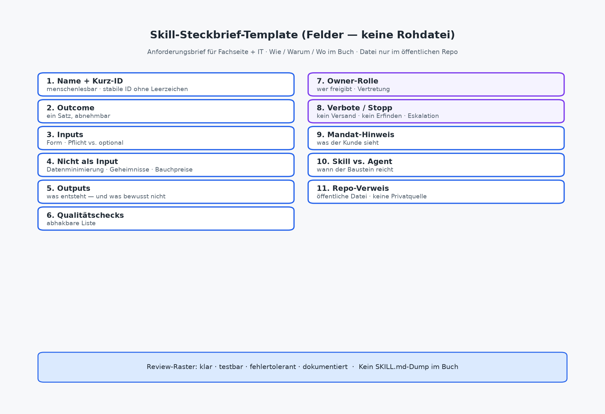

# Skills bauen und erklären

Kapitel 7 hat die Pipeline geliefert: Trigger, Inputs, Schritte, Entscheidungen, Owner, Output, Nachweis und die Regel, erst die kleinste ausreichende Intervention zu wählen. Dieses Kapitel macht den nächsten Handgriff: **Skills spezifizieren und erklären**, ohne Code ins Buch zu drucken und ohne private Autor-Repos zu verlinken.

Bauen heißt hier nicht: YAML tippen, bis es „irgendwie läuft“. Bauen heißt: einen Anforderungsbrief schreiben, den Geschäftsführung verstehen, IT betreiben und Solo morgen starten kann. Die technischen Dateien liegen öffentlich unter https://github.com/rmdroid/cursor/tree/main/buch/skills-die-geld-verdienen/skills, zum Download und Copy-Paste. Im Fließtext bleiben Wie, Warum und Wo. Kein SKILL.md-Dump. Kein Verweis auf private Skill-Repos.

Wer Kapitel 4 gelesen hat, kennt Grenzen und Lebenszyklus. Wer Kapitel 7 gelesen hat, hat oft schon halb spezifiziert. Hier füllen wir die Lücke zwischen Pipeline und Betrieb: Qualitätskriterien, Steckbrief-Template, Walkthrough der drei Muster und die Anti-Patterns, die Bibliotheken still zerstören.

## Anforderungsbrief statt Code im Buch

Ein Skill verdient im Buch keinen Quelltext. Er verdient einen **Anforderungsbrief**, denselben Steckbrief, den Fachseite und IT gemeinsam tragen können. Der Brief beantwortet die Fragen, die später Freigabe und Review steuern: Was ist fertig? Was muss vorliegen? Was entsteht? Woran erkennt man Qualität? Was ist verboten? Wer gibt frei?

Warum kein Code im Kapitel? Drei Gründe reichen. Erstens: GF und Solo lesen Outcomes und Grenzen, nicht Dateiformate. Zweitens: Skills leben. Versionen ändern sich; gedruckter Dump wird sofort stale. Drittens: Das Buch bleibt Mandats- und Betriebsbuch, kein Spiegel eines Repos. Die Rohdateien gehören dorthin, wo man sie kopieren und pflegen kann: in die öffentliche Buch-Bibliothek unter `buch/skills-die-geld-verdienen/skills/` im Repo `rmdroid/cursor`.

Der Anforderungsbrief ist keine Dekoration vor dem „eigentlichen“ Skill. Er *ist* die fachliche Spezifikation. Die technische Datei übersetzt ihn, sie ersetzt ihn nicht. Wenn Brief und Datei auseinanderlaufen, gilt der Brief für Freigabe und Haftung; die Datei muss nachgezogen werden. Das ist unbequem und genau deshalb nützlich.

Praktisch entsteht der Brief aus der Pipeline von Kapitel 7. Trigger und Schritte sagen, *wann* und *in welcher Kette* der Baustein sitzt. Der Steckbrief sagt, *was der Baustein allein leistet*. Ein Agent orchestriert später mehrere Briefe, er erfindet keine Outcomes nebenbei.

Ein guter Brief liest sich in fünf Minuten. Er braucht keine Folien. Er braucht Sätze, die eine Vertretung am Montagmorgen versteht: „Das kommt rein, das kommt raus, das darf die KI nicht, das gibt Hans frei.“ Wenn der Brief nur für die Person lesbar ist, die ihn geschrieben hat, ist er noch Werkbank nicht Betriebskapital. Dieselbe Messlatte gilt später für die Repo-Datei: Wer sie öffnet, soll denselben Vertrag finden, nicht einen anderen Dialekt.

### Was in den Brief gehört und was nicht

Gehört hinein: Name und Kurz-ID, Outcome in einem Satz, Inputs und Nicht-Inputs, Outputs, Qualitätschecks als abhakbare Liste, Owner-Rolle, Verbote und Stopp-Bedingungen, Hinweis was der Kunde sieht, Entscheidung Skill vs. Agent.

Gehört *nicht* hinein: Prompt-Kopien aus Chat-Verläufen als „Dokumentation“, geheime API-Keys oder Zugangswege, erfundene ROI-Zahlen, Alleskönner-Wünsche („und gleich versenden“), Verweise auf private Repos.

Wer den Brief in dreißig Minuten nicht grob füllen kann, hat noch keinen Skill-Kandidaten, sondern eine Idee. Zurück zur Pipeline oder zum Vereinfachen. Dreißig Minuten sind Absicht: Sie erzwingen Schärfe. Was in dieser Zeit nicht benennbar wird, wird im Alltag auch nicht freigabefähig, dann hilft mehr Tippen am Prompt selten, und mehr Ehrlichkeit am Prozess oft.

## Qualitätskriterien: klar, testbar, fehlertolerant, dokumentiert

Vier Kriterien trennen Betriebskapital von Prompt-Theater. Sie gelten für den Steckbrief und für die spätere Datei gleichermaßen.

**Klar.** Outcome, Inputs und Outputs sind so benannt, dass eine Vertretung denselben Baustein starten könnte, ohne den Chat-Verlauf des Erfinders zu kennen. „Mach was Sinnvolles mit den Notizen“ ist nicht klar. „Strukturierter Angebotsentwurf mit Leistungen, Annahmen, offenen Punkten und nächsten Schritten“ ist klar. Klarheit ist die Voraussetzung für Freigabe: Was unklar spezifiziert ist, kann niemand verantwortlich abnehmen.

**Testbar.** Es gibt Beispiel-Inputs (echt anonymisiert oder synthetisch) und eine Checkliste, an der Mensch oder Review entscheidet: bestanden / nachschärfen / verwerfen. Testbar heißt nicht „automatisierte CI für jeden Prompt“. Es heißt: Sie können denselben Input zweimal fahren und Abweichungen benennen. Wenn Sie nicht sagen können, wann der Skill *gescheitert* ist, können Sie auch nicht sagen, wann er gut war.

**Fehlertolerant.** Fehlende oder widersprüchliche Inputs führen zu Stopp, Nachfrage oder markiertem Platzhalter nicht zu erfundenen Fakten, Preisen oder Beschlüssen. Fehlertoleranz ist hier das Gegenteil von „die KI rätselt höflich weiter“. Ein guter Skill eskaliert früh und sichtbar. Verbote und Stopp-Bedingungen gehören deshalb in denselben Brief wie der Outcome, nicht in eine Fußnote „irgendwann IT“.

**Dokumentiert.** Name, Zweck, Version oder Änderungsvermerk, Owner, Ablageort der aktuellen Variante. Dokumentation light reicht: Wer nutzt welchen Stand? Was hat sich seit dem Pilot geändert? Undokumentierte Varianten sind Prompt-Kopien mit neuem Namen. Kapitel 4 hat das Anti-Pattern schon benannt; hier wird es zum Ablehnungsgrund vor der Freigabe.

Die vier Kriterien greifen ineinander. Klarheit ohne Testbarkeit erzeugt schöne, ungeprüfte Texte. Testbarkeit ohne Fehlertoleranz erzeugt Tempo mit erfundenen Fakten. Fehlertoleranz ohne Dokumentation erzeugt Stopps, die niemand nachvollziehen kann. Dokumentation ohne Klarheit erzeugt Ordner voller Dateien, die niemand anfasst. Deshalb Review immer als Viererpack nicht als Einzelnote „klingt gut“.

Die vier Kriterien sind auch das Review-Raster vor dem Pilot-Gate: Fehlt Klarheit, stoppt Spezifikation. Fehlt Testbarkeit, stoppt Fläche. Fehlt Fehlertoleranz, stoppt Mandats-Einsatz. Fehlt Dokumentation, stoppt Übergabe. Kapitel 9 vertieft Betrieb und Eskalation; Kapitel 10 die Messung ohne Fantasie-ROI. Hier reicht die Bau-Regel: **Ohne die vier Kriterien kein „wir rollen das aus“.**

## Abbildung: Steckbrief-Template

*Abbildung: Steckbrief-Template. Felder für Spec ohne Rohcode; lauffähige Dateien liegen im Repo.*

Bis dahin die Feldliste, dasselbe Raster, das Anhang B als Checkliste führen und Anhang D für die drei Beispiele ausfüllen wird:

1. **Name** (menschenlesbar) und **Kurz-ID** (stabil, klein, ohne Leerzeichen)
2. **Outcome** (ein Satz, abnehmbar)
3. **Inputs** (Form, Pflicht vs. optional)
4. **Nicht als Input** (Datenminimierung, Geheimnisse, Bauchpreise)
5. **Outputs** (was entsteht und was bewusst nicht)
6. **Qualitätschecks** (abhakbare Liste)
7. **Owner-Rolle** (wer freigibt; Vertretung)
8. **Verbote / Stopp** (Versand, Erfinden, Eskalationsfälle)
9. **Mandat-Hinweis** (was der Kunde sieht)
10. **Skill vs. Agent** (wann der Baustein reicht)
11. **Repo-Verweis** (öffentliche Datei, keine Privatquelle)

Wer diese elf Zeilen für einen Use Case füllen kann, hat Kapitel 8 im Kern erledigt. Der Rest ist Walkthrough und Warnung.

## Walkthrough: drei Muster-Skills (Wie / Warum / Wo)

Die drei Buch-Beispiele decken Mandatsalltag ab, ohne Abteilungsbots zu fordern: Angebot aus Kickoff, Protokoll mit Entscheidungen, kurzer Mandats-Status. Sie sind für Mittelstand und Freelancer spezifiziert nicht aus privaten Autor-Bibliotheken übernommen. Basisordner: https://github.com/rmdroid/cursor/tree/main/buch/skills-die-geld-verdienen/skills.

Im Buch erklären wir Wie, Warum und Wo. Die vollständigen Steckbriefe liegen im Briefing und später in Anhang D; die lauffähigen Dateien im Repo. Kein Rohdump hier.

### 1. Angebot aus Kickoff, der Cover-Anschluss

**Datei:** https://github.com/rmdroid/cursor/tree/main/buch/skills-die-geld-verdienen/skills/angebot-aus-kickoff/SKILL.md

**Warum.** Uneinheitliche Angebote und vergessene Annahmen kosten Nacharbeit und Vertrauen, intern bei der Vertretung, extern beim Kunden, der „zwei Firmen in einer“ spürt. Der wiederkehrende Schmerz ist selten „wir können nicht schreiben“. Es ist: Rohbau-Qualität driftet, Preis und Scope rutschen in den Prompt, niemand weiß, welche Variante gilt.

**Wie.** Inputs sind Kickoff-Notizen oder ein kurzer Transkript-Auszug, bekannte Rahmenbedingungen, optional die interne Angebotsstruktur. Output ist ein strukturierter Entwurf: Ausgangslage, Leistungsumfang, Annahmen, offene Punkte, nächste Schritte, plus Owner-Checkliste. Preis, Rabatt und verbindlicher Scope bleiben Platzhalter oder markierte Menschenentscheidung. Qualitätschecks trennen Annahmen vom Scope und verbieten stille Erweiterungen. Stopp bei fehlenden oder widersprüchlichen Notizen ohne Klärungsweg; kein Versand aus dem Skill.

**Wo.** Nach dem Kickoff, bevor jemand „schnell mal ein Angebot“ in den Chat tippt. In der Pipeline von Kapitel 7 sitzt der Baustein in den Schritten „Stoff ordnen → Rohbau“; Entscheidungen Preis/Scope/Versand bleiben Owner. Solo nutzt ihn als Wochenfokus; Mittelstand koppelt ihn an Vorlage und Ablageort. Agent erst, wenn Notizen holen, Entwurf und interne Prüfung verkettet werden sollen. Versand bleibt Mensch.

Typischer Fehlgriff beim Bau: Den Skill „kundenreif“ machen wollen, indem Preis und Liefertermin „sinnvoll geschätzt“ werden. Genau das zerstört Fehlertoleranz und Freigabe. Lieber einen unvollständigen, ehrlichen Rohbau, der Owner füllt Kommerz in Minuten, statt Stunden Detektivarbeit an stillen KI-Zusagen zu leisten.

### 2. Protokoll mit Entscheidungen. Struktur statt Gedächtnis

**Datei:** https://github.com/rmdroid/cursor/tree/main/buch/skills-die-geld-verdienen/skills/protokoll-entscheidungen/SKILL.md

**Warum.** Meetings erzeugen Stoff; Nacharbeit versinkt in Threads. Ohne feste Abschnitte werden Wünsche zu Schein-Beschlüssen und Maßnahmen verlieren ihren Owner. Der Skill verdient sich nicht durch Eloquenz, sondern durch Trennung: beschlossen / offen / zu tun mit Namen.

**Wie.** Inputs: Notizen oder gekürzter Transkript-Auszug, Teilnehmende/Rollen, optional Agenda. Outputs: Kurzkopf, Entscheidungen als Beschlüsse formuliert, offene Punkte, Maßnahmen mit Owner und Termin (oder „Termin offen / Owner nachziehen“), Markierung unklarer Stellen. Qualitätschecks verbieten erfundene Beschlüsse und stilles Umdeuten („wir prüfen“ wird nicht zu „wir liefern“). Kein automatischer Versand; bei Kundenmeetings zusätzliche Freigabe vor externem Versand.

**Wo.** Direkt nach Jour fixe, Projekttermin oder Kundenabstimmung, solange der Stoff noch frisch ist. In der Mittelstands-Fallskizze aus Kapitel 7 hängt er an der Kickoff-Nacharbeit; im Solo-Alltag am Terminende. Orchestrierung nur, wenn Holen → Protokoll → Ablage ohne Handklicken laufen soll. Der Meeting-Owner gibt frei; das ist keine IT-Entscheidung.

Der Bau-Test ist einfach: Kann jemand, der nicht im Termin war, Entscheidungen von offenen Punkten unterscheiden und Maßnahmen an Owner hängen ohne nachzufragen, „was ihr eigentlich gemeint habt“? Wenn nein, ist der Steckbrief noch zu weich oder der Input zu dünn. Beides ist ein Spezifikationsproblem, kein Modellproblem.

### 3. Status Mandat kurz. Entwurf bis zur Freigabe

**Datei:** https://github.com/rmdroid/cursor/tree/main/buch/skills-die-geld-verdienen/skills/status-mandat-kurz/SKILL.md

**Warum.** Regelmäßige Transparenz hält Mandate ruhig, bis Ton und Inhalt schwanken oder interne Notizen mit kundenfähigen Sätzen vermischt werden. Der teure Fehler ist nicht der langsame Status. Es ist der Status, der ohne Freigabe oder mit erfundenem Fortschritt nach außen geht.

**Wie.** Inputs: interner Stand (erledigt / in Arbeit / blockiert), bekannte Blocker, nächste Schritte, optional Ton-Vorgabe, Kennzeichnung was schon kundenkommuniziert ist. Outputs: kurzer kundenfähiger Entwurf, getrennte Liste „nur intern“, Markierung „Entwurf. Versand gesperrt bis Freigabe“, optional Betreffvorschlag ohne Absendeaktion. Checks: keine Vermischung intern/extern, keine Nebenbei-Preise oder Scope-Änderungen, Zeitangaben nur wenn belegt. **Kein Senden** aus dem Skill; Stopp bei veraltetem oder widersprüchlichem Stand und bei eskalierenden Rechts-/Geldthemen.

**Wo.** Wochenschluss oder vereinbarter Statusrhythmus. Für Solo oft der erste Muster-Skill der Woche: ein Fokus, Freigabe zeitlich vom Entwurf trennen (Kapitel 5). Für Teams: derselbe Baustein, ein Mandats-Owner, Vertretung nur mit klarer Freigabeberechtigung. Ein Agent, der Status ohne Freigabe versendet, verletzt die Mandatsgrenze, das ist Stopp-Kriterium, kein Feature.

### Was die drei gemeinsam lehren

Ein Outcome. Sichtbare Annahmen und Lücken. Mensch für Geld, Recht, Außenwirkung. Repo-Datei statt Chat-Geheimnis. Wer einen vierten Skill spezifiziert, kopiert dieses Raster nicht den Prompt von Dienstag.

Reihenfolge beim Lernen: oft **status-mandat-kurz** oder **protokoll-entscheidungen** zuerst, weil Freigabe und Außenwirkung greifbar sind und der Stoff täglich anfällt. **angebot-aus-kickoff** danach, wenn Vorlage und kommerzielle Grenze sitzen. Alle drei am selben Tag „einführen“ erzeugt denselben Zoo, den Kapitel 3 und 7 vermeiden wollen, nur diesmal mit schönen Dateinamen.

## Anti-Patterns: Skill-Friedhof, Prompt-Kopien, versteckte Rechte

Drei Muster zerstören Bibliotheken zuverlässiger als fehlende Tools.

**Skill-Friedhof.** Viele Namen, unklare Aktualität, niemand testet, niemand schaltet ab. Vertrauen sinkt, Schatten-Prompts blühen wieder. Gegenmittel: Owner je aktivem Skill, sichtbare aktuelle Version, Ablage-Pflicht für Ungenutztes (Kapitel 4 und 9). Inventur vor dem nächsten Baustein: Was ist aktiv, was rostet, was fliegt raus?

**Prompt-Kopien.** Derselbe Baustein als fünf Chat-Varianten, Folien-Anhänge und „die gute Version von Mara“. Gegenmittel: ein Name, ein Steckbrief, eine Repo-Datei, Änderungsvermerk. Copy-Paste aus dem öffentlichen Buch-Ordner ist erlaubt und gewollt, paralleles Weiterbasteln ohne Version ist es nicht. Wer „schnell eine Variante“ braucht, versioniert oder forkt bewusst; er legt keinen zweiten geheimen Standard an.

**Versteckte Rechte.** Der Skill „darf mal eben“ CRM, Postfach oder Dateifreigaben lesen, die der Outcome nicht braucht oder Schreibrechte, die Freigabegrenzen unterlaufen. Gegenmittel: Nicht-Inputs und Verbote im Steckbrief, Datenminimierung aus Kapitel 6, IT-Freigabe für Zugänge, Abschaltbarkeit vor Fläche. Versteckte Rechte sind kein Effizienztrick. Sie sind ein Betriebs- und Haftungsrisiko mit Tempo-Vorwand.

Weitere Bau-Sünden in einem Atemzug. Gegenmittel jeweils ein Satz: Alleskönner-Skill → ein Outcome, Orchestrierung separat. Live ohne Freigabe → Stufe intern → kundenreif. Versand im Skill → Stopp, Owner sendet. Skills als Afterthought hinter dem Agenten → Bibliothek zuerst (Kapitel 7). Code oder Privat-Repo im Buch → nur https://github.com/rmdroid/cursor/tree/main/buch/skills-die-geld-verdienen/skills. Kapitel 15 sammelt die Fehler buchweit; hier reichen sie als Bau-Gate: **Wer eines der drei Kern-Anti-Patterns offen mitbringt, bekommt keine Freigabe, sondern Nacharbeit am Brief.**

Ein kurzer Selbsttest vor dem Commit in die Bibliothek: Würden Sie den Skill einer Vertretung geben mit Brief, ohne Ihren Chat-Verlauf? Wenn der Bauch nein sagt, fehlt Klarheit oder Dokumentation. Würden Sie ihn mit sensiblen Mandatsdaten fahren, ohne die Nicht-Inputs gelesen zu haben? Wenn ja, fehlen Verbote. Beides ist billiger zu heilen *vor* der Freigabe als *nach* dem ersten Kundenmail-Schrecken.

## Vom Steckbrief zur Datei und zurück

IT und technisch affine Solos übersetzen den Brief in die SKILL.md im Repo. Die Übersetzung ist mechanisch, wenn der Brief gut ist: Name, Beschreibung, Abschnitte Outcome/Inputs/Outputs/Checks/Verbote/Owner. Die Datei darf Präzision ergänzen; sie darf keine Verbote streichen und keine Versandautomatik „aus Bequemlichkeit“ nachrüsten.

Fachseite und GF lesen weiterhin den Brief oder die Wie/Warum/Wo-Darstellung dieses Kapitels. Wenn die Datei driftet, ist das ein Pflegefall im Lebenszyklus (Test → Freigabe → Betrieb), kein Grund, wieder in Chat-Varianten zu flüchten. Solo bündelt beide Hüte, braucht aber denselben Vertrag mit sich selbst: Freigabe und Versand bleiben zeitlich und mental getrennt vom Entwurf.

Der Brückensatz zu Kapitel 9: Spezifikation ohne Betrieb wird zum Friedhof; Betrieb ohne Spezifikation wird zu Schatten-KI. Beides vermeiden Sie, indem der Anforderungsbrief die gemeinsame Wahrheit bleibt.

## Lesepfad light und Ausblick

GF liest Qualitätskriterien, Freigabe-/Verbotszeilen der drei Muster und die Anti-Patterns zu Rechten und Fläche. IT liest Template-Felder, Repo-Kopplung und Übersetzung Brief → Datei. Solo wählt einen Muster-Skill, füllt das Template handschriftlich und fährt eine Woche mit Checkliste, noch ohne Agent.

Als Nächstes: **Betrieb** (Kapitel 9). Routinen erst nach Bewährung, Fehlermodi, Qualitätsloop, Abschalten. Dann Nutzen messen (Kapitel 10). Wer baut, ohne zu spezifizieren, automatisiert Hoffnung. Wer spezifiziert, ohne Anti-Patterns zu kennen, baut den Friedhof gleich mit.

---

### Was die Geschäftsführung entscheidet

Dass Skills über Anforderungsbriefe freigegeben werden nicht über Demo-Prompts; welche der Outcomes (Angebot, Protokoll, Status) ins Portfolio dürfen; dass versteckte Rechte und Versand ohne Freigabe Stopp-Kriterien sind; Owner und Ablage-Pflicht gegen den Skill-Friedhof; dass das öffentliche Buch-Repo die Referenzquelle ist, keine privaten Sammlungen.

### Was die IT-Leitung umsetzt

Steckbrief-Felder in Betriebsobjekte übersetzen: Dateiort unter https://github.com/rmdroid/cursor/tree/main/buch/skills-die-geld-verdienen/skills, Versionierung, Zugänge nach Nicht-Inputs, Logs, Abschaltbarkeit; Brief und SKILL.md synchron halten; Alleskönner und Schatten-Kopien inventarisieren; Fachbereichen beim Schnitt „ein Outcome“ und bei Stopp-Bedingungen helfen bevor Orchestrierung gebaut wird.

### Was Solo / Freiberufler morgen starten können

Template (Feldliste oben) für **einen** Skill auf ein Blatt. Datei wählen und Steckbrief danebenlegen:

- Angebot: https://github.com/rmdroid/cursor/tree/main/buch/skills-die-geld-verdienen/skills/angebot-aus-kickoff/SKILL.md
- Protokoll: https://github.com/rmdroid/cursor/tree/main/buch/skills-die-geld-verdienen/skills/protokoll-entscheidungen/SKILL.md
- Status: https://github.com/rmdroid/cursor/tree/main/buch/skills-die-geld-verdienen/skills/status-mandat-kurz/SKILL.md

Eine Woche manuell mit Qualitätschecks; Versand und Preis nur nach bewusster Freigabe; Prompt-Varianten löschen oder archivieren, nicht parallel „gültig“ lassen. Noch keinen Agenten bauen.
