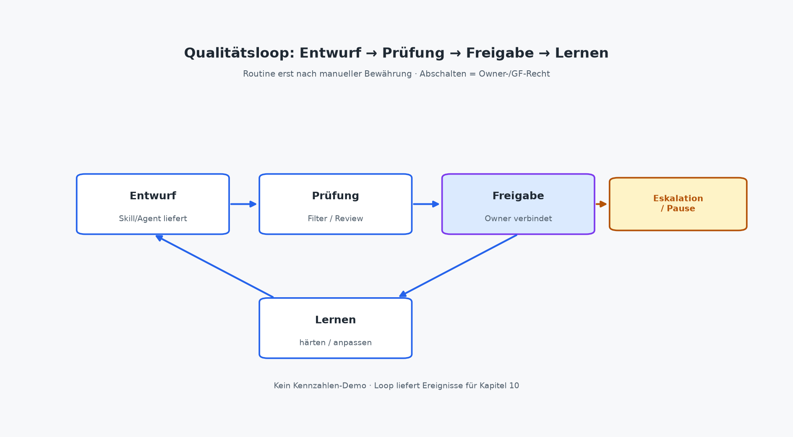

# Betrieb: Routinen, Qualität, Eskalation

Kapitel 7 hat die Pipeline geliefert, Kapitel 8 den Anforderungsbrief und die Qualitätskriterien. Danach beginnt der Teil, an dem viele Vorhaben still verrosten oder still eskalieren: **der Betrieb**. Spezifikation ohne Betrieb wird zum Friedhof. Betrieb ohne Spezifikation wird zu Schatten-KI. Beides vermeiden Sie nicht mit einem besseren Prompt, sondern mit Routinen, die erst nach Bewährung laufen, mit sichtbaren Fehlermodi, mit einem Qualitätsloop und mit dem Führungsrecht, abzuschalten und aufzuräumen.

Betrieb klingt nach Rechenzentrum. Hier meint er etwas Schmaleres: Was passiert jede Woche mit demselben Skill? Wer prüft? Wer gibt frei? Was gilt als Fehler und wer stoppt? Für die Geschäftsführung ist Betrieb Steuerbarkeit. Für IT ist er Logging, Version und Abschaltbarkeit. Für Solo ist er der Kalender-Rhythmus, der verhindert, dass der „gute Prompt von Dienstag“ heimlich Standard wird.

## Wann eine Routine sinnvoll ist, erst nach Bewährung

Eine **Routine** ist ein wiederkehrender Ablauf mit Trigger, Skill (oder schmalem Agenten), Review und Freigabe, kalendarisch oder ereignisgebunden, nicht „wenn wir dran denken“. Routinen verdienen Vertrauen erst, wenn der manuelle Ablauf mit Steckbrief und Checkliste bewährt ist. Wer die Routine vor der Bewährung startet, automatisiert Hoffnung und nennt es Effizienz.

Die Reihenfolge bleibt die aus Kapitel 7 und 8: Pipeline füllen → kleinste Intervention → Skill spezifizieren → Pilot mit Stop-Kriterium → **dann** Routine. Der Pilot fragt: Tragen Inputs und Review? Die Routine fragt: Können wir denselben Pfad bewusst wiederholen, ohne jedes Mal neu zu erfinden und ohne Freigabe zu überspringen?

Eine Routine ist sinnvoll, wenn vier Bedingungen zusammenkommen. Der Ablauf ist **wiederkehrend**. Wochenschluss-Status, Kickoff-Nacharbeit, Angebotsrohbau nach Termin, nicht Einzelfallkunst. Der **manuelle** Durchlauf mit Steckbrief hat mehrmals funktioniert: Inputs kamen, Output traf Pflichtfelder, Review blieb tragbar. Owner und Freigabegrenze sind **namentlich** und halten unter Vertretung oder Pause. Und ein **Stop-Kriterium** steht vor dem Start: Was setzt uns zurück auf manuell oder auf den Pilot-Modus?

Eine Routine ist *nicht* sinnvoll, wenn der Prozess noch driftet, die Vorlage fehlt, der Owner wechselt heimlich oder „Versand mitdenken“ noch im Skill steckt. Dann ist Vereinfachen oder Nachschärfen die Intervention, nicht der Kalender-Trigger. Kapitel 14 baut denselben Gedanken in den 90-Tage-Rahmen: Tage 31–60 härten Qualität. Routine erst, wenn reif.

Zwei Buch-Muster eignen sich früh für Routinen, weil Stoff und Freigabe greifbar sind:

- **status-mandat-kurz**: strukturierter Statusentwurf; Versand erst nach Freigabe
- **protokoll-entscheidungen**: Meeting-Nacharbeit mit sichtbaren Beschlüssen und offenen Punkten

Basis: https://github.com/rmdroid/cursor/tree/main/buch/skills-die-geld-verdienen/skills. **angebot-aus-kickoff** folgt oft danach, wenn Vorlage und kommerzielle Grenze sitzen. Alle drei am selben Montag „routinisieren“ erzeugt denselben Zoo wie drei Abteilungsbots, nur mit Trigger.

Solo-Regel light: Eine Woche manuell mit Checkliste. Zweite Woche derselbe Skill am festen Slot, Freigabe zeitlich vom Entwurf getrennt. Erst wenn Review nicht länger dauert als der alte Tipparbeit-Pfad *und* Inputs besser oder zumindest stabil sind, bleibt die Routine. Sonst zurück ohne Gesichtsverlust. Stopp ist Betriebshygiene, nicht Scheitern.

Mittelstand denselben Test, nur mit benannter Vertretung: Wenn der Owner im Urlaub ist und die Routine nur noch „irgendwie weiterläuft“, war sie nie betriebsreif, sie war an eine Person gekoppelt, nicht an Outcome und Freigabegrenze. Bewährung heißt auch: Der Ablauf übersteht Abwesenheit, ohne dass Chat-Verläufe zur heimlichen Zweit-Wahrheit werden.

Was die Routine *nicht* ersetzt: Urteilskraft an Entscheidungspunkten. Preis, Scope, verbindliche Zusagen, kundenreifer Versand bleiben Mensch, auch wenn der Trigger jeden Freitag tickt. Die Routine holt Stoff und Form in den Loop. Sie darf keine Freigabe vortäuschen, nur weil der Kalender grün ist.

## Fehlermodus: stale Daten, Doppelarbeit, fehlende Freigabe

Betrieb ohne benannte Fehlermodi endet in stiller Drift. Drei Muster tauchen im Mandatsalltag immer wieder auf, unabhängig vom Modell. Sie sind Organisations- und Datenfehler, keine „KI-Launen“.

**Stale Daten.** Der Skill läuft mit veraltetem Stand: alte Notizen, alter CRM-Auszug, Status von letzter Woche, Protokollstoff ohne die Entscheidung von gestern. Der Output wirkt frisch und ist inhaltlich gestrig. Gegenmittel: Input-Frischheit als Qualitätscheck, „Stand von wann?“ und Stopp bei Widerspruch oder Unklarheit (Kapitel 8: fehlertolerant). Routine-Trigger ohne Frischeprüfung sind Tempo mit Verfallsdatum. Für **status-mandat-kurz** heißt das konkret: interner Stand und Blocker müssen zum vereinbarten Rhythmus gehören; sonst Pause und Klärung, kein „trotzdem kundenfähig formulieren“.

**Doppelarbeit.** Zwei Varianten desselben Skills, Chat-Prompt und Bibliotheksdatei, zwei Owner-Wahrheiten, Status im Thread und in der Ablage. Die Routine multipliziert den Murks, statt ihn zu ersetzen. Gegenmittel: eine aktuelle Version je Skill, ein Artefaktort, Handoff mit Status (Kapitel 5). Inventur vor dem nächsten Trigger: Was ist aktiv, was ist Schatten? Doppelarbeit ist oft kein Fleiß, sie ist fehlende Ablage-Ownership.

**Fehlende Freigabe.** Der Rohbau wirkt so fertig, dass jemand ihn für freigegeben hält oder die Routine „spart“ den Prüfschritt, weil es eilig ist. Genau hier entstehen Außenrisiko und Mandatsbruch. Gegenmittel: Freigabe als Stufe und Zeitpunkt, nicht als Höflichkeitsstempel. Entwurf und kundenreife Freigabe zeitlich trennen, auch wenn dieselbe Person beide Hüte trägt. Ein Agent oder eine Routine, die Status oder Protokoll ohne Freigabe versendet, verletzt die Grenze aus Kapitel 5 und 8. Das ist Stopp-Kriterium, kein Feature-Wunsch für „nächste Version“.

Die drei Fehlermodi verstärken sich gegenseitig. Stale Daten plus fehlende Freigabe erzeugen kundenreife Texte auf gestrigem Stand. Doppelarbeit plus fehlende Freigabe erzeugen zwei „gültige“ Versionen, von denen eine schon draußen ist. Deshalb Review nicht als Einzelcheck „klingt gut“, sondern als kurzer Fehlermodus-Blick: Frisch? Eine Wahrheit? Freigegeben, ja oder nein?

Für **protokoll-entscheidungen** heißt stale oft: Beschlüsse ohne die Korrektur aus dem Nachgespräch, Maßnahmen ohne den Owner, der sich nach dem Termin gemeldet hat. Doppelarbeit heißt: Protokoll im Chat, in der Mail und in der Ablage, drei Töne, eine Verwirrung. Fehlende Freigabe heißt: „Ich hab’s schon raus, war ja nur eine Zusammenfassung.“ Genau dann werden Wünsche zu Schein-Beschlüssen nach außen.

Weitere Betriebszeichen in einem Atemzug: Qualität kippt trotz Nachschärfung → Pause und Owner-Review. Review dauert dauerhaft länger als der frühere manuelle Schritt, ohne bessere Inputs → Intervention zurücksetzen. Zugänge oder Schreibrechte weiten sich still → IT-Inventur, Least Privilege. Owner fehlt oder wechselt heimlich → kein Go für Fläche. Kapitel 10 misst Eskalationen und Review-Last; hier reicht die Betriebsregel: **Fehlermodi benennen, bevor die Routine live geht, sonst eskaliert Hoffnung.**

Eskalation ist der vorgesehene Ausgang, nicht der Ausnahmezustand. Skill oder Routine markieren Lücke, Widerspruch, Rechts-/Geldnähe oder Anhang-Nähe → Owner entscheidet: nachschärfen, manuell, Pause, Freigabe durch Führung. IT stellt die technische Stopp-Möglichkeit. Fachseite und GF tragen die inhaltliche. Wer Eskalation als „Störung des Automaten“ behandelt, baut Blindflug.

## Qualitätsloop: Entwurf → Prüfung → Freigabe → Lernen

Qualität im Betrieb ist keine einmalige Abnahme vor dem Go-Live. Sie ist ein **Loop**, der jede Instanz und den Skill selbst verbessert, ohne Konzern-QM-Theater.

**Entwurf.** Skill oder Mensch erzeugt den Rohbau in den Grenzen des Steckbriefs: Pflichtfelder, markierte Annahmen, sichtbare Lücken. Kein Versand, kein Preis „geschätzt“, keine stillen Beschlüsse. Der Entwurf ist abnehmbar oder er ist noch Stoff. Für Protokoll und Status gilt dieselbe Disziplin: beschlossen vs. offen, intern vs. kundenfähig getrennt.

**Prüfung.** Owner oder benannte Fachrolle prüft gegen die Checkliste aus dem Anforderungsbrief: Klarheit, Vollständigkeit, Fehlertoleranz (keine erfundenen Fakten), Ton, Mandatsgrenze. Prüfung ist Arbeit mit Ergebnis: bestanden / nachschärfen / verwerfen nicht „gesehen“. Wenn dieselbe Person entwirft und prüft, trennt sie die Momente: Rohbau erzeugen, kurze Pause, dann bewusst gegen die Liste. Solo kennt das Muster aus Kapitel 5; im Betrieb wird es zur Routine-Regel.

**Freigabe.** Ausdrückliche Erlaubnis für den nächsten Schritt, intern ablegen, an Vertretung übergeben, kundenreif versenden. Freigabe braucht Zeitpunkt und Name (oder Rolle). Chat-Reaktion mit Daumen ist keine Spur. Ohne Freigabe bleibt der Stand „Entwurf. Versand gesperrt“, wie **status-mandat-kurz** es verlangt. Führung gibt frei, was Geld, Recht, Personal, Strategie oder kritische Außenwirkung berührt, die rechte Spalte aus Kapitel 5 bleibt menschlich.

**Lernen.** Was war falsch am Input, am Steckbrief, an der Checkliste, an der Routine-Frequenz? Lernen schreibt zurück in den Brief und die Repo-Datei. Version oder Änderungsvermerk, nicht in einen neuen geheimen Prompt. Drei Instanzen mit demselben Fehler sind ein Spezifikations- oder Prozessfall, kein „Modell-Pech“. Lernen ohne Ablage erzeugt denselben Friedhof, den Kapitel 8 als Anti-Pattern benannt hat.

Lernen darf klein sein. Ein Satz im Änderungsvermerk: „Stopp, wenn Blocker älter als sieben Tage ohne Update.“ Oder: „Intern-Liste vor kundenfähigem Absatz prüfen, zweimal vermischt.“ Das reicht, wenn es die nächste Instanz verändert. Große Retro-Workshops ohne Repo-Update sind Theater; ein vermerktes Stopp-Zeichen ist Betrieb.

Der Loop in einem Satz: **Entwurf liefert, Prüfung filtert, Freigabe verbindet, Lernen härtet.** Fehlt Prüfung, wird Tempo zum Risiko. Fehlt Freigabe, wird der Rohbau zur Zusage. Fehlt Lernen, rostet die Routine bei steigender Review-Last. Messung der Last und der Eskalationen folgt in Kapitel 10; der Loop liefert dort die Ereignisse, die überhaupt zählbar sind.

Praktisch reicht ein schmales Betriebsblatt je Outcome: Trigger und Skill-Version; wer prüft; wer freigibt; Stopp-Zeichen; Ort des Nachweises light (Version, Freigabezeitpunkt, Artefakt). Das ist Betriebshandbuch light in der Fachsprache. Kapitel 12 vertieft die IT-Seite. Hier zählt: Der Loop ist sichtbar, bevor die Fläche wächst.

## Abschalten und Aufräumen als Führungsaufgabe

Abschalten ist kein IT-Ticket und kein Eingeständnis. Es ist **Führungs- und Fachentscheidung**: Dieser Outcome, diese Routine, dieser Skill oder Agent erfüllt den Zweck nicht mehr oder das Risiko übersteigt den Nutzen. IT stellt die technische Möglichkeit bereit (Zugänge, Trigger, Orchestrierung stoppen). Owner und GF entscheiden, *dass* gestoppt wird. Wer Qualität nicht stoppen darf, ist kein Owner. Kapitel 5 hat das gesetzt; im Betrieb wird es ernst.

Aufräumen gehört dazu. Pausierte und abgelegte Skills brauchen einen sichtbaren Status: aktiv / pausiert / abgelegt. Sonst bleiben tote Trigger, rostende Dateien und Schatten-Prompts „für alle Fälle“. Die öffentliche Buch-Bibliothek (Basis oben) ist der technische Ort für die Buch-Muster; Ihr Portfolio ist die Führungsansicht: Welche Outcomes laufen? Welche ruhen? Welche fliegen raus?

Wann abschalten oder pausieren ohne Drama: Stop-Kriterium greift. Owner fehlt nachhaltig. Freigabegrenze wird regelmäßig unterlaufen. Doppelvarianten lassen sich nicht auf eine Wahrheit bringen. Nutzen ist unklar und Kapitel 10 liefert keine tragfähige Spur, dann ist Pause ehrlicher als Hoffnung. Aufräumen heißt: Trigger aus, Version markieren, Chat-Varianten archivieren oder löschen, Vertretung informieren, was *nicht* mehr gilt.

Pause und Ablage sind zwei Stufen. Pause: Der Outcome bleibt im Portfolio, der Trigger steht, Nacharbeit am Brief oder an den Inputs ist geplant. Ablage: Der Skill ist nicht mehr Betriebsmittel; wer ihn trotzdem braucht, startet bewusst neu mit Pipeline und Bewährung, nicht mit dem rostenden Prompt. Wer alles nur „pausiert“, um niemanden zu verärgern, hat abgelegt ohne es zu sagen und die Schatten-Prompts blühen weiter.

Solo braucht denselben Mut in klein: Eine Routine, die Review frisst und Inputs nicht verbessert, fliegt aus dem Kalender. Ein Skill, den Sie seit Wochen nicht gegen die Checkliste gefahren haben, ist kein Betriebsmittel, er ist Ballast. Aufräumen ist hier Selbstführung; die Logik ist dieselbe wie im Mittelstand.

Führung, die nur „mehr KI“ feiert und nie ablegt, züchtet den Friedhof. Führung, die Outcomes und Stopps reviewt, hält die Bibliothek mandatstauglich. Das Portfolio-Review aus Kapitel 5 (Outcomes, Owner, pausiert/abgelegt) ist genau dieser Rhythmus. Kapitel 15 wird denselben Fehler („Live ohne Abschaltplan“) buchweit sammeln; hier ist die positive Formulierung: **Abschalten ist Teil des Betriebs, nicht sein Gegenteil.**

## Abbildung: Qualitätsloop

*Abbildung: Qualitätsloop. Entwurf → Prüfung → Freigabe → Lernen, mit Ausgang Eskalation/Pause. Routine erst nach manueller Bewährung; Abschalten ist Owner-/GF-Recht. Keine Kennzahlen-Demo.*

## Betrieb ohne Zoo, die kurze Disziplin

Drei Sätze halten den Alltag zusammen. Keine Routine vor Bewährung. Kein Trigger ohne benannten Fehlermodus und Freigabestufe. Kein aktiver Skill ohne Owner und Abschaltpfad. Wer diese Disziplin hält, braucht keinen Agenten-Zoo und keinen zweiten Fulltime-Job namens „Prompt-Pflege“. Wer sie bricht, merkt es zuerst an Review-Last und Eskalationen und später an Vertrauen, das still abwandert.

Die Naht zu Kapitel 8 bleibt: Der Anforderungsbrief ist die gemeinsame Wahrheit. Der Betrieb prüft sie jede Instanz. Drift zwischen Brief und gelebter Routine ist ein Pflegefall, zurückschreiben oder stoppen, nicht „im Chat schnell korrigieren und hoffen“.

## Lesepfad und Naht zu Messung

GF liest Bewährungsregel vor Routine, Fehlermodus fehlende Freigabe, Abschalten als Führungsrecht. IT liest stale Daten und Doppelarbeit als Integrations- und Versionsproblem, Nachweis light, technische Stopp-Möglichkeit. Solo nimmt einen Muster-Skill, oft Status oder Protokoll, fährt den Qualitätsloop eine Woche bewusst und notiert ein Stop-Kriterium im Kalender.

Als Nächstes: **Nutzen messen und steuern** (Kapitel 10). Zeit, Fehlerquote, Durchlauf, Eskalationen, Kostenarten ohne Fantasie-ROI. Wer betreibt, ohne zu messen, steuert nach Gefühl. Wer misst, ohne betreiben zu können, zählt Demo-Schulden. Der Betrieb dieses Kapitels liefert die Ereignisse. Kapitel 10 liefert die Steuergrößen.

---

### Was die Geschäftsführung entscheidet

Dass Routinen erst nach manueller Bewährung und mit Stop-Kriterium starten. Dass fehlende Freigabe und unterlaufene Grenzen Stopp bedeuten, nicht „später dokumentieren“. Dass Abschalten und Aufräumen Führungsrechte sind und Portfolio-Reviews Outcomes (aktiv / pausiert / abgelegt) steuern. Owner-Pflicht je produktiver Routine. Dass Lernen in Steckbrief und Bibliothek zurückschreibt, nicht in Schatten-Prompts.

### Was die IT-Leitung umsetzt

Routinen technisch begrenzen: Trigger, Skill-Version, Identitäten, Logs, Abschaltbarkeit. Stale Inputs und Doppelablagen sichtbar machen. Brief und Repo-Datei synchron halten (Buch-Bibliothek). Eskalations- und Pausenzustände betreibbar machen. Fachbereichen beim Qualitätsloop und Nachweis light helfen, ohne Ownership an Tools zu übertragen.

### Was Solo / Freiberufler morgen starten können

Einen wiederkehrenden Schritt wählen (Status oder Protokoll). Kurzlink danebenlegen: **status-mandat-kurz** oder **protokoll-entscheidungen** unter https://github.com/rmdroid/cursor/tree/main/buch/skills-die-geld-verdienen/skills.

Eine Woche manuell mit Checkliste. Zweite Woche fester Slot, Entwurf und Freigabe zeitlich trennen. Fehlermodi notieren: Was wäre stale, Doppel, fehlende Freigabe bei *Ihnen*? Stop-Kriterium in den Kalender. Was nicht trägt, aus dem Kalender nehmen. Aufräumen zählt als Erfolg.
