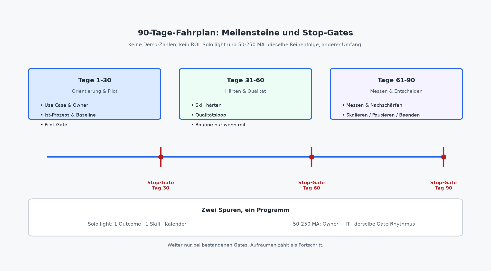

# 90-Tage-Fahrplan

Teil IV hat die Rollenpfade gesetzt: Geschäftsführung mit Portfolio und Freigaben (Kapitel 11), IT mit Identitäten, Zugängen und Betrieb light (Kapitel 12), Solo mit Kalender, Hüten und Grenzen (Kapitel 13). Teil V beginnt hier mit dem, was Teams oft als PowerPoint kennen und selten als Betrieb: **einen kalendarischen Rahmen mit Meilensteinen und Stop-Gates**, der aus Methode, Skill und Messung eine Entscheidung macht.

Der Fahrplan ist kein Konzern-Programm und keine „KI-Transformation in Quartalen“. Er ist ein schmaler Bewährungsraum für **einen Outcome**: wählen, Owner benennen, Ist-Prozess sichtbar machen, Pilot fahren, Skill härten, nur bei Reife eine erste Routine, dann messen, nachschärfen und bewusst skalieren, pausieren oder beenden. Kapitel 3 filtert, ob sich der Use Case überhaupt lohnt. Kapitel 7 liefert die Pipeline und das Pilot-Gate. Kapitel 8 den Steckbrief. Kapitel 9 den Qualitätsloop. Kapitel 10 die Steuergrößen ohne Fantasie-ROI. Hier werden dieselben Elemente auf neunzig Tage gelegt.

Drei Haltungen halten den Fahrplan ehrlich. **Ein Outcome vor dem Zoo.** Parallel starten drei Skills und keiner trägt. **Stop-Gates vor dem Tempo.** Wer die Gates nur aufschreibt, um den Kickoff zu überstehen, baut Demo-Schulden. **Aufräumen zählt als Fortschritt.** Pausieren und Beenden sind steuernde Ergebnisse, nicht Gesichtsverlust.

Der Fahrplan ersetzt keine der früheren Kapitel. Er kalendert sie. Wer Tag 1 ohne Realitätscheck und Pipeline beginnt, spart keine Zeit, sondern verschiebt den Murks in den Kalender. Wer Tag 90 ohne Entscheidung feiert, hat neunzig Tage Beschäftigung gebucht.

Muster-Skills für den Alltag liegen unter https://github.com/rmdroid/cursor/tree/main/buch/skills-die-geld-verdienen/skills: **status-mandat-kurz**, **angebot-aus-kickoff**, **protokoll-entscheidungen**. Im Buch bleiben Wie, Warum und Wo. Rohdateien im Repo, kein Abschreiben hier.

## Tage 1–30: wählen, besitzen, sehen, pilotieren

Die ersten dreißig Tage entscheiden, ob Sie später steuern oder nur beschäftigen. Ziel ist nicht „Agent live“. Ziel ist: ein benennbarer Outcome, ein namentlicher Owner, ein sichtbarer Ist-Prozess, eine Baseline und ein Pilot mit Stop-Kriterien auf einer Seite.

**Use Case wählen (Kapitel 3 und 7).** Nehmen Sie einen wiederkehrenden Schritt am Wertstrom, nicht einen Abteilungsnamen. Status am Mandatsende, Kickoff-Nacharbeit, Angebotsrohbau aus Notizen: das sind Outcomes. „Vertrieb bekommt einen Bot“ ist Organigramm-Hoffnung. Prüfen Sie den Realitätscheck. Selten und einzelfallig → manuell lassen. Vorlage und Pflichtfelder fehlen → zuerst vereinfachen. Outcome klar und wiederholbar → skillen. Orchestrierung nötig und Zugänge klar → erst dann schmaler Agent. Die kleinste ausreichende Intervention aus Kapitel 7 bleibt Pflichtreihenfolge.

**Owner setzen (Kapitel 5 und 11).** Eine Person trägt Qualität, Freigabegrenze und Abschaltung. Vertretung oder Pause notieren. Ohne Namen ist der Pilot eine Demo mit Publikum. Solo: Owner sind Sie. Dann trennen Sie mindestens Entwurf und kundenreife Freigabe zeitlich (Kapitel 13).

**Ist-Prozess auf eine Seite (Pipeline Kapitel 7).** Trigger, Inputs, Schritte, Entscheidungen, Owner, Output, Nachweis. Was „im Kopf von …“ lebt, wird sichtbar oder wird nicht automatisiert. Datenminimierung mitdenken: Was der Outcome nicht braucht, kommt nicht in den Kontext. Freigabegrenze in einem Satz: Was darf der Skill, was bleibt Mensch (Geld, Recht, Außenwirkung, finale Zusage)?

**Baseline vor dem Pilot-Feier.** Eine knappe Serie manuell mit Checkliste und Steckbrief-Idee: Zeiten light (Rohbau, Review, Freigabe), Fail-Arten, Eskalationsgründe. Kapitel 10 nennt die Größen. Hier reicht die Spur, bevor der Skill „Erfolg“ heißt. Ohne Baseline ist jede spätere Zahl eine Geschichte.

**Pilot-Gate und Start.** Pipeline ausgefüllt, Intervention gewählt (oft ein Muster-Skill, selten sofort Agent), Owner und Freigabe namentlich, Zugänge und Nachweis light mit IT geklärt, Stop-Kriterien unterschrieben. Dann startet der Pilot im begrenzten Geltungsbereich: ein Auftragstyp, eine Mandatsreihe, ein Zeitraum. Skill-Kurzlink danebenlegen, z. B. **status-mandat-kurz** oder **protokoll-entscheidungen** unter der Basis-URL oben. Steckbrief aus Kapitel 8 füllen, nicht improvisieren.

**Stop-Gate Tag 30.** Weiter nur, wenn Outcome, Owner, Ist-Prozess, Baseline und Pilot-Gate stehen und der Pilot mindestens angelaufen ist. Fehlt Owner, Freigabegrenze oder Stop-Kriterium: Pause. Fehlt brauchbarer Input: zurück auf Vereinfachen, nicht „größeres Modell“. Wer in den ersten dreißig Tagen drei Outcomes parallel öffnet, hat den Fahrplan verlassen.

Praktischer Takt light: Woche 1 wählen und besitzen, Woche 2 Ist-Prozess und Baseline, Woche 3–4 Pilot-Gate und erste Instanzen. Der Takt ist Orientierung, kein Scrum-Dogma. Was zählt, ist das Gate, nicht die schöne Wochenfolie.

## Tage 31–60: härten, Qualität, Routine nur, wenn reif

Die zweite Phase ist Handwerk, nicht Launch-Party. Der Pilot läuft. Jetzt wird der Skill härter: Inputs schärfen, Verbote klarziehen, Checkliste tragen, Qualitätsloop bewusst fahren. Eine Kalender-Routine kommt **nur**, wenn Reife nachweisbar ist.

**Skill härten (Kapitel 8 und 9).** Steckbrief nach Pilot-Lernen nachziehen: Pflichtfelder, Fail-Arten, Eskalationsausgänge, was der Skill *nicht* darf. Version in der Bibliothek, keine Schatten-Prompts parallel. Doppelvarianten zusammenführen oder ablegen. Wenn Review dauerhaft den alten Tipparbeit-Pfad übersteigt und Inputs nicht besser werden: zurück auf Pilot-Modus oder manuell, nicht „noch ein Prompt“.

**Qualität als Loop, nicht als Gefühl.** Entwurf → Prüfung → Freigabe → Lernen (Kapitel 9). Prüfung filtert. Freigabe verbindet. Lernen landet im Steckbrief, nicht im Chat-Verlauf. Fehlermodi benennen, bevor Tempo steigt: stale Inputs, Doppelarbeit durch Zweitversionen, Rohbau, der still nach außen rutscht. Eskalation ist vorgesehenes Signal, kein Makel.

**Erste Routine nur bei Reife.** Vier Bedingungen aus Kapitel 9 müssen zusammenkommen: Ablauf wiederkehrend. Manueller bzw. Pilot-Durchlauf mit Steckbrief hat mehrmals getragen. Owner und Freigabe halten unter Vertretung oder Pause. Stop-Kriterium steht und wird ernst genommen. Fehlt eine Bedingung, bleibt der bewusste Slot ohne Automatik-Trigger. Routine ohne Bewährung automatisiert Murks und Hoffnung.

**IT parallel, ohne Ownership zu übernehmen (Kapitel 12).** Identitäten, Least Privilege, Log- und Versionsort, Abschaltbarkeit. Fachseite trägt Inhalt. IT trägt Betriebsfähigkeit. Schatten-Kopien und breite Schreibrechte sind Stop-Zeichen, nicht „Agilität“.

**Stop-Gate Tag 60.** Weiter Richtung Fläche oder feste Routine nur, wenn Qualitätsloop trägt, Version eindeutig ist und kein Stop-Kriterium greift. Review-Last und Fehlerquote (Checklisten-Fails) dürfen nicht dauerhaft gegen den Nutzen laufen. Freigabegrenze unterlaufen → Soft-Stop der Automatik, Grenze schärfen. Owner fehlt → kein Go. Wer hier eine zweite Abteilung „mitnimmt“, ohne denselben Outcome und dieselbe Spur, öffnet den Zoo aus Kapitel 3.

Wenn der Pilot trägt, aber die Routine noch nicht reif ist: bewusst im Pilot-Modus bleiben. Das ist kein Scheitern. Es ist die Disziplin aus Kapitel 9, Trigger erst zu setzen, wenn Bewährung und Stopp sitzen.

## Tage 61–90: messen, nachschärfen, entscheiden

Die dritte Phase macht aus Betrieb eine Portfolio-Entscheidung. Messung ohne Fantasie-ROI (Kapitel 10): Zeit, Fehlerquote, Durchlauf, Eskalationen, Review-Last. Kostenarten: Tool, Review-Zeit, Fehlentscheidungs-Schwere. Rhythmus schmal: Instanz-Loop, kurzer Pilot-/Solo-Blick, dann Portfolio-Entscheidung.

**Messen heißt vergleichen.** Baseline gegen Pilot-Fenster, gleicher Auftragstyp, gleiche Grenze. Trends und Richtung reichen oft. Leere Felder sind ehrlicher als erfundene Prozentwerte. Geprüfte Zahlenclaims gehören, sofern vorhanden, nach Anhang C, nicht als Buch-Wahrheit in den Fließtext.

**Nachschärfen oder zurücksetzen.** Steckbrief und Inputs nach Fail-Arten justieren. Scope driftet → Outcome-Satz neu ziehen. Durchlauf verschlechtert sich, weil Freigabe Flaschenhals wird → Ownership und Vertretung, nicht Modellwechsel. Tool-Rechnung sinkt bei steigender Review-Last und Eskalation → Warnung, kein Spartipp.

**Drei erlaubte Enden (Kapitel 10 und 11).** **Skalieren** heißt Geltungsbereich desselben Outcomes erweitern (mehr Mandate desselben Typs, zweite Rolle mit demselben Skill und derselben Grenze), nicht Abteilungsvarianten ohne Gate. **Pausieren** heißt Trigger aus, Version markieren, lernen, später neu entscheiden. **Beenden** heißt ablegen, Chat-Varianten aufräumen, Vertretung informieren, was nicht mehr gilt. Alle drei sind Steuerung. „Weiterlaufen lassen, weil wir schon so weit sind“ ist keines.

**Stop-Gate Tag 90.** Ohne Entscheidung kein automatisches Weiter. Portfolio-Status setzen: aktiv / Pause / Ablage. Wer skaliert, kopiert bewährte Skills und Grenzen. Wer pausiert oder beendet, hält das Portfolio mandatstauglich. Ein zweiter Outcome startet erst, wenn der erste ein klares Ende hat, nicht parallel aus Nervosität.

Schreiben Sie die Entscheidung in einem Satz auf dasselbe Blatt wie Outcome und Owner. „Skalieren auf Mandatstyp B mit Skill-Version X und unveränderter Freigabegrenze“ ist eine Entscheidung. „Wir schauen weiter“ ist keines.

## Anpassungen: Solo und Betriebe mit 50–250 MA

Dieselbe Logik, anderer Apparat. Die Gates bleiben. Was sich ändert, ist Takt, Dokumentationsgewicht und wer welche Hüte trägt.

**Solo / Freiberufler (Kapitel 13).** Ein Outcome, ein Skill, Kalender-Disziplin. Tage 1–30: Blatt Outcome / Owner (ich) / Freigabegrenze / Stop-Kriterium. Eine Woche Baseline. Muster-Skill wählen, nicht drei. Tage 31–60: Qualitätsloop im eigenen Slot, Entwurf und Versand trennen. Routine nur, wenn der Slot trägt. Tage 61–90: Mini-Cockpit mit Review-Last plus einer zweiten Größe. Entscheidung aktiv / Pause / Ablage ohne Gesichtsverlust vor sich selbst. Kein zweites Dashboard. Kundengeheimnisse und Außenwirkung vor Tempo. Orientierung Kapitel 6 parallel, kein Rechtsrat.

**Betrieb mit etwa 50–250 Mitarbeitenden.** Mehr Rollen, mehr Vertretung, mehr Versuchung zum Zoo. Tage 1–30: GF wählt den ersten Portfolio-Outcome. Fachseite füllt Pipeline. IT klärt Zugänge und Nachweis light. Owner namentlich, nicht „das Team“. Pilot bewusst schmal (Auftragstyp, Region, Mandatsreihe). Tage 31–60: Härten in Bibliothek und Betriebshandbuch light. Routine erst nach Bewährung. Schatten-KI inventarisieren und an Outcomes koppeln (Kapitel 12), nicht moralisieren. Tage 61–90: Portfolio-Review mit Steuergrößen. Skalieren nur Geltungsbereich. Pause und Ablage als Führungsrecht (Kapitel 11). RACI light reicht. Konzernformulare nicht. Zwei produktive Outcomes schlagen zwölf Experimente ohne Gate.

**Gemeinsame Regel.** Solo darf schlanker dokumentieren, aber nicht anonymer entscheiden. Mittelstand darf mehr Mitwirkende haben, aber nicht Ownership verdünnen. Stop-Gates gelten in beiden Größenordnungen. Wer die Gates „für uns nicht“ streicht, weil das Team klein oder groß ist, hat den Fahrplan durch eine Stimmung ersetzt.

## Abbildung: 90-Tage-Timeline

*Abbildung: 90-Tage-Timeline. Phasen 1–30 / 31–60 / 61–90 mit Stop-Gates an Tag 30, 60 und 90. Spur Solo light vs. 50–250 MA nur als Label. Keine Demo-Zahlen, kein Fantasie-ROI.*

Die Grafik visualisiert Reihenfolge und Sperren. Der Text oben bleibt die Arbeitsanweisung. Wer die Timeline ohne Gates zeichnet, zeichnet Hoffnung.

## Vom Fahrplan zu Fehlern und Gegenmitteln

Kapitel 14 schließt den Umsetzungsrahmen. Kapitel 15 sammelt typische Fehler, wenn Ownership fehlt, Murks automatisiert wird oder Live ohne Freigabe startet, jeweils mit Gegenmittel und Rückverweis. Wer den Fahrplan hält, braucht Kapitel 15 seltener als Korrektur und öfter als Checkliste vor dem nächsten Outcome.

Lesepfad light: Realitätscheck Kapitel 3, Methode und Pilot Kapitel 7, Bauen Kapitel 8, Betrieb Kapitel 9, Messung Kapitel 10, Rollen 11–13, dieser Fahrplan als Kalender. Rechtliches Orientierungskapitel 6 parallel zur Freigabegrenze, nicht als Ersatz für Sorgfalt.

Gemeinsam gilt: **Neunzig Tage sind genug, um einen Outcome ehrlich zu prüfen, und zu kurz, um einen Zoo zu rechtfertigen.** Skills verdienen Geld, wenn sie wiederkehrende Roharbeit tragen und Menschen an den Gates entscheiden dürfen.

---

### Was die Geschäftsführung entscheidet

Welcher Outcome die neunzig Tage bekommt. Owner und Freigabegrenze namentlich. Stop-Gates verbindlich (Tag 30 / 60 / 90). Baseline vor Pilot-Feier. Routine erst nach Reife. Am Ende skalieren, pausieren oder beenden, ohne Automatik-Weiterlauf. Keine Flächen-Freigabe aus Demo-Hochstimmung und ohne Fantasie-ROI. Portfolio-Status aktiv / Pause / Ablage. Aufräumen als Führungsrecht.

### Was die IT-Leitung umsetzt

Pilot und ggf. Routine technisch begrenzen: Identitäten, Least Privilege, Version, Logs, Abschaltbarkeit, Nachweis light. Bibliotheksort an https://github.com/rmdroid/cursor/tree/main/buch/skills-die-geld-verdienen/skills bzw. interne Spiegelung koppeln. Schatten-Varianten und Zugangsdrift melden. Stop-Gates technisch ausführbar machen (Trigger aus, Rechte ein). Fachseite beim Steckbrief und bei der Spur stützen, ohne Ownership an Tools zu übertragen. Details Kapitel 12. Events und Cockpit-Felder Kapitel 10.

### Was Solo / Freiberufler morgen starten können

1. Ein Blatt für *einen* wiederkehrenden Schritt: Outcome / Owner (ich) / Freigabegrenze / Stop-Kriterium / geplante Gates.
2. Einen Muster-Skill wählen: **status-mandat-kurz**, **angebot-aus-kickoff** oder **protokoll-entscheidungen** unter https://github.com/rmdroid/cursor/tree/main/buch/skills-die-geld-verdienen/skills. Woche 1 Baseline manuell mit Checkliste.
3. Tage 1–30: Pipeline light (Kapitel 7), Pilot im eigenen Kalender, Entwurf und Freigabe trennen.
4. Tage 31–60: Steckbrief nachschärfen. Feste Routine nur, wenn der Loop trägt.
5. Tage 61–90: Review-Last und eine zweite Größe vergleichen. Aktiv / Pause / Ablage entscheiden. Aufräumen zählt.
6. Zweiten Outcome erst nach klarem Ende des ersten. Kein Zoo, kein zweiter Fulltime-Job.

Morgen reicht Gate eins: Outcome und Stop-Kriterium im Kalender. Der Rest des Fahrplans folgt nur, wenn dieses Gate hält.
